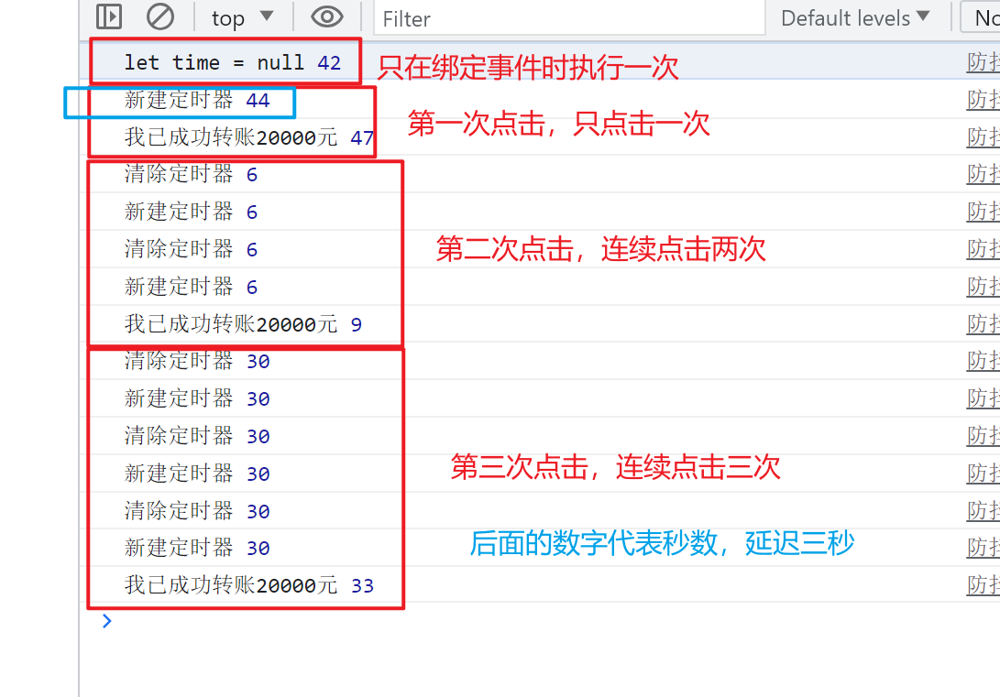
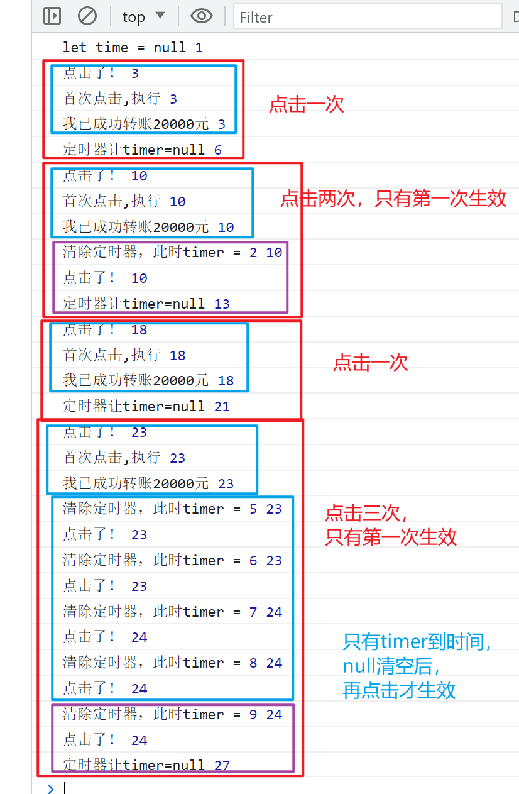
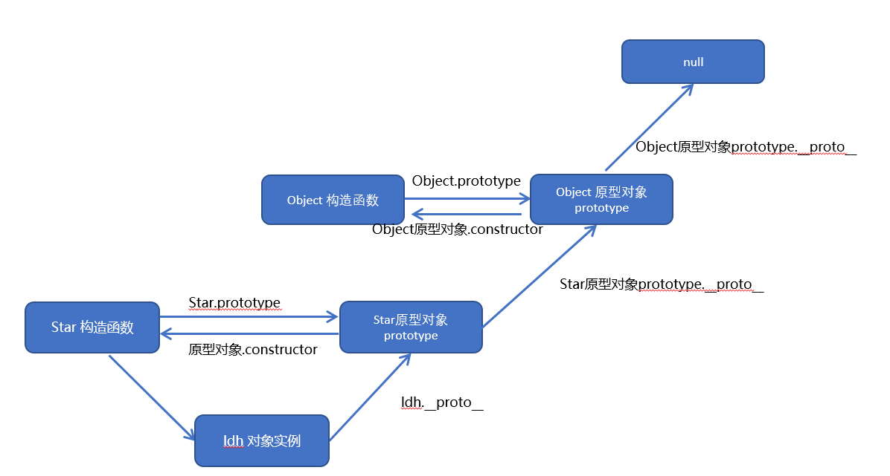

# javascript基础

### 数据类型

**typeof操作符**<br/>
- 都是**小写**
- 没有null、有function

`undefined`<br/>
`boolean`<br/>
`string`<br/>
`number`<br/>
`object` 注意，null返回的是这个<br/>
`function` 注意，函数返回的是这个，不是对象<br/>
`symbol`<br/>

### 深复制和浅复制

深复制（Deep Copy）和浅复制（Shallow Copy）是在计算机科学中用于描述对象或数据结构复制的两种不同方式。

深复制是创建一个完全独立的新对象，它的所有属性和子对象都会被递归地复制到新对象中。换句话说，深复制会创建一个原始对象的副本，原始对象和副本之间没有任何关联，修改其中一个对象不会影响另一个对象。

浅复制是创建一个新对象，但该新对象的属性只是简单地引用原始对象的属性。换句话说，浅复制只复制对象的引用，而不是实际的值。因此，如果修改了原始对象的属性，那么浅复制的对象也会受到影响。

举个例子来说明：

```javascript 
    // 深复制
    let originalObj = { name: 'John', age: 30, hobbies: ['reading', 'playing'] };
    let deepCopyObj = JSON.parse(JSON.stringify(originalObj));

    originalObj.name = 'Jane';
    originalObj.hobbies.push('coding');

    console.log(originalObj); // { name: 'Jane', age: 30, hobbies: ['reading', 'playing', 'coding'] }
    console.log(deepCopyObj); // { name: 'John', age: 30, hobbies: ['reading', 'playing'] }

    // 浅复制
    let originalArray = [1, 2, 3];
    let shallowCopyArray = originalArray;

    originalArray.push(4);

    console.log(originalArray); // [1, 2, 3, 4]
    console.log(shallowCopyArray); // [1, 2, 3, 4]

```
在深复制的例子中，原始对象和深复制对象是完全独立的，修改一个对象不会影响另一个对象。而在浅复制的例子中，原始数组和浅复制数组是引用同一个对象，修改一个对象会影响另一个对象。

**Array.from()复制数组**
Array.from 方法在复制数组时执行的是浅复制。

Array.from 方法用于将类数组对象或可迭代对象转换为真正的数组。它创建一个新的数组，其中包含传入的对象的副本。对于数组对象来说，Array.from 方法会复制数组的元素，并**创建一个新的数组**。

然而，对于**嵌套**的对象或数组，Array.from 方法执行的是**浅复制**。这意味着嵌套对象或数组的引用将被复制到新数组中，而不是创建嵌套对象或数组的副本。

下面是一个示例来说明这一点：
```js
    let originalArray = [1, 2, [3, 4]];

    let shallowCopyArray = Array.from(originalArray);

    originalArray[0] = 10;
    originalArray[2][0] = 30;

    console.log(originalArray); // [10, 2, [30, 4]]
    console.log(shallowCopyArray); // [1, 2, [30, 4]]

```

### 数组

#### 创建数组
1. `new Array()` 
   1. 传一个数字，是长度
   2. 传几个其它值，是元素
2. 字面量
3. `Array.from()`类数组结构转换为数组
   1. 字符串
   2. Map、Set、任何可迭代对象
4. `Array.of()`一组参数转换为数组

#### 数组方法

**会改变数组**的方法

> 记忆：当前数组是主要对象，操作都是用来改变它的。都是希望在其原基础上改变：剪接、排序、翻转、填充、增删

```javascript
arr.splice(); //返回新数组：被删的值
arr.sort(); //不需要返回值：返回原数组的引用
arr.reverse(); //不需要返回值：返回原数组的引用
arr.fill(); //不需要返回值：返回原数组引用
arr.push(); //返回新数组长度
arr.pop();
arr.shift();
arr.unshift();
```

**纯函数**方法 
> 记忆：当前数组只是用来加工的原材料，大部分都是返回加工后的新数组
```javascript
arr.slice(); 
arr.concat(); 
arr.map(); // 别忘return处理结果
arr.forEach(); // 返回undefined
arr.fliter(); 
arr.reduce(); // 返回累加值
arr.every(); 
arr.some();
arr.find(); // 返回满足条件的第一个元素
arr.entries(); // 返回数组的迭代器对象
// entries用法
const fruits = ['apple', 'banana', 'cherry'];
const iterator = fruits.entries();

for (const [index, value] of iterator) {
  console.log(index, value);
}

```
#### 数组遍历
- ​for循环
    - 缺点是写法比较麻烦​。
- ​forEach
    - 缺点是无法中途跳出forEach循环，break命令或return​命令都不能奏效。
     ```javascript
        const array = ['a', 'b', 'c'];
        array.forEach((value, index) => {
            console.log(`Index: ${index}, Value: ${value}`);
        });

        ```
- for...of
    - 它可以与break、continue和return​配合使用
    - 只能遍历值，除非与其他方法共用
    ```javascript
        const array = [1, 2, 3, 4, 5];

        for (const value of array) {
        console.log(value);
        }

    ```
### 字符串

#### 字符串中的字母遍历
- for循环
- for...in...
    ```javascript
        for (let i in str) {
        console.log(str[i]);
        }
    ```
- for...of...
    ```javascript
        for(let char of str){
            console.log("字符："+char);
        }
    ```
### 闭包

闭包是指有权访问**另外一个函数作用域**中的变量的**函数**

特点：
- 函数嵌套函数
- 内层函数可以访问外层函数的变量和参数

核心作用：
- 防止变量和参数被垃圾回收机制回收

风险：
- 滥用可能造成内存泄漏，不用的时候使内部函数引用指向null

示例：
```javascript
    function outer() {
        let a = 10;
        return function inner() {
            a++;
            console.log(a);
        }
    }
    let f = outer();
    f(); // 输出11
    f(); // 输出12
    f(); // 输出13
    // 这里的局部变量a没有被回收，它持久存在
    f = null; // 为避免内存泄漏，用完后可以清空引用
```
闭包中的this对象:
- 一般情况下，闭包中的this指向window(严格模式下是undefined)
```js
  window.id = 'The window';
  let obj = {
    id: 'My Obj',
    getIdFunc() {
      return function() {
        return this.id;
      }
    }
  }
  console.log(obj.getIdFunc()()); // 输出：The window
```
- 调整：把外层的**this用其他变量保存起来**。如果是想保留外层的arguments，也需要用其他变量保存起来。因为：**每个函数被调用时都会自动创建自己的this和arguments**，内部函数永远不可能直接访问外部函数的这两个变量。

```js
  window.id = 'The window';
  let obj = {
    id: 'My Obj',
    getIdFunc() {
      return function() {
        let that = this; // 重点
        return that.id;
      }
    }
  }
  console.log(obj.getIdFunc()()); // 输出：My Obj
```

### 防抖和节流
防抖（Debounce）和节流（Throttle）是两种常用的函数优化技术，用于**控制函数的触发频率**，以提高性能和用户体验。

- 防抖的应用场景：

    - 表单输入：当用户连续输入时，延迟一定时间后才执行相关操作，避免频繁触发输入事件。
    - 按钮点击：当用户快速点击按钮时，只触发一次点击事件，避免多次重复操作。
    - 窗口调整：当窗口大小调整时，延迟一段时间后再执行相关逻辑，避免频繁触发调整事件。
- 节流的应用场景：

    - 页面滚动：当用户滚动页面时，间隔一定时间执行滚动事件，避免频繁触发滚动事件。
    - 频繁请求：当需要发送请求时，控制请求的频率，例如每隔一定时间发送一次请求，避免过多的请求发送到服务器。
    - 鼠标移动：当用户快速移动鼠标时，控制事件的触发频率，避免过多的事件触发。
  
总的来说，**防抖**适用于需要**延迟处理**的场景，确保在**一段时间内只执行一次**操作；**节流**适用于需要**控制执行频率**的场景，确保在一定时间间隔内执行操作。具体使用哪种技术取决于具体的需求和场景。

### 防抖

**基础版**：没有处理首次点击延迟的情况
```html
<button id="btn">付款</button>
    <script>
        // 原理理解：
        // 防抖的目的：多次点击、只有最后一次起作用（在某一时间段内重复点击无效）
        //类比：晚上睡不着听音乐，设置定时关闭音乐，它会在你最后设置的时间关闭
        // 所以：每次：先清掉原来的定时，重新定时

        const btn = document.getElementById('btn');
        // 绑定点击事件
        // btn.addEventListener('click', pay, false);
        btn.addEventListener('click', debounce(pay, 2000), false);

        // 付款
        function pay(e) {
            // this指向应该是button
            console.log(this);
            // e应该是button点击事件: e参数是传过来的arguments中的第一个元素
            console.log(e);
            // 事件逻辑：
            console.log('我已成功转账20000元');
        }

        // 防抖保护层
        function debounce(fn, delay) {
            // 闭包变量：保持变量存在、不被回收
            let timer = null;
            // 返回函数是因为：绑定时需要填入函数对象，而不是调用函数
            return function() {
                // 每次都先清掉定时器
                if (timer) { clearTimeout(timer)}
                // 重新定时
                timer = setTimeout(() => {
                    // 此this/arguments是btn事件调用对应传入的，本来是直接传给处理函数的
                    // this指向button
                    // arguments的第一个参数是e
                    // 通过箭头函数、指向不变、参数不变的特点，传给处理函数
                    fn.apply(this, arguments)
                }, delay);
            }
        }
    </script>
```
执行效果如下：看了就懂了，连续点击，只有最后一次起作用


**进阶版**：处理首次点击延迟问题<br/>
与基础版不同的是：连续点击只有**首次**点击生效

```javascript
function debounce(fn, delay) {
    let timer = null;
    return function() {
        if (timer) { 
            clearTimeout(timer)
        } 

        // 只有首次点击才执行
        if (timer === null) {
            fn.apply(this, arguments)
        }

        // 首次点击之后，过一段时间再点才能好使（）
        timer = setTimeout(() => {
            timer = null; // 变成首次
        }, delay);
    }
}
```
看执行结果就懂了（或许）


### 节流
- 与防抖不同的是，防抖的计时开始于被点击的时候。节流的计时是不受影响的固定的时间间隔
- 它不需要定时器，但需要一个开始时间的标志
- 执行之后，重置开始时间
```javascript
function throttle(fn, delay) {
    // 使用闭包，保存一个不被回收的变量，这样就可以通过它连续控制时间间隔
    let beginTime = 0;
    return function() {
        const curTime = new Date().getTime();
        // 如果时间间隔满足条件则执行
        if (curTime - beginTime > delay) {
            fn.apply(this,arguments);
            // 重置时间
            beginTime = curTime;
        }
    }
}
```

### call/apply/bind
**区别**：
- Call / apply ：会立即执行函数，两者基本区别在于传参不同
- Bind：不会立即执行，需要手动调用

**具体使用方式**：
- `call(thisArg, arg1, arg2, ...)`
- `apply(thisArg, [argsArray])`
- `bind(thisArg, arg1, arg2, ...)`


### this

在 JavaScript 中，关于 this 的指向有以下几种情况：

- 全局上下文中的 this 指向全局对象（在浏览器环境中为 window 对象）。
- 在普通**函数**中，this 的值取决于函数的**调用方式**：
    - 如果函数作为**对象的方法**调用，this 指向调用该方法的对象。
    - 如果函数作为**普通函数**调用（函数独立调用，不是xxx.fn()），this 指向全局对象（在浏览器环境中为 window 对象）。
    - 如果函数使用 **new** 关键字调用，this 指向新创建的对象。
    - 如果函数通过 call()、apply() 或 bind() 方法调用，this 可以**显式**地指定为传递给这些方法的第一个参数。
- **箭头函数**的 this 指向**外层作用域中的 this**，与函数的调用方式无关。

### 创建对象的几种模式

**工厂模式**
问题：没有解决对象标识问题，即新创建的对象是什么类型
```javascript
// 创建对象、赋予其属性和方法、返回对象
function createPerson(name, age, job) {
    let o = new Object();
    o.name = name;
    o.age = age;
    o.job = job;
    o.sayName = function() {
        console.log(this);
        console.log(this.name);
    }
    return o;
}

let person1 = createPerson('张莎莎', 18, '学生');
let person2 = createPerson('张天狗', 28, '前端开发');

person1.sayName();
```
**构造函数模式**
与工厂模式的区别
- 没有显式地创建对象
- 属性和方法直接赋值给了this
- 没有return

好处：可以确保实例被标识为特定类型。能用instanceof操作符来确定。（`obj instanceof Object 也= true`）
```javascript
function Person(name, age, job) {
    this.name = name;
    this.age = age;
    this.job = job;
    this.sayName = function() {
        console.log(this.name);
    }
}

let person1 = new Person('张莎莎', 18, '学生');
let person2 = new Person('张天狗', 28, '前端开发');

person1.sayName();

```
**new操作符完成的操作：**
1. 在内存中创建一个对象
2. **新对象的__proto__属性被赋值为构造函数的prototype属性**
3. **this指向新对象**
4. 给新对象添加属性和方法
5. 返回对象

构造函数的特点
- 构造函数也是函数，与普通函数唯一的区别就是调用方式不同
  - 构造函数用new调用，如果直接调用，this会指向全局对象，通过call或apply调用会指向被安排的对象
- 主要问题：其定义的方法在每个实例上都要创建一遍，不同实例上的函数同名但不相等。因为都是做一件事，没有必要定义两个Function实例
  - `person1.sayName == person2.sayName // false`

**原型模式**
- 在原型上定义的方法和属性，可以被实例对象共享
  - 实例和原型有直接联系
  - 实例和构造函数没有直接联系（实例上没有指向构造函数的指针）
- 确定对象原型的方法
  - `Person.prototype.isPrototypeOf(person1); // true`
  - `Object.getPrototypeOf(person1) == Person.prototype; // true`
- 属性搜索过程：实例和原型之间的链接是简单的指针，而不是保存的副本
  - 对象实例本身搜索
  - 进入原型对象搜索
- 确定某个属性是否在对象**或**其原型上
  - `"name" in person1`
- 确定某个属性是实例**自身**的还是其原型对象的
  - `person1.hasOwnProperty("name")`
- 对象属性枚举（顺序问题待定）
  - `for...in...`实例+原型 可枚举属性 顺序不确定
  - `Object.keys()` 实例 可枚举属性 
  - `Object.getOwnPropertyNames()` 实例 全部属性 
  - `Object.getOwnPropertySymbols()` 实例 符号属性 
  - `​Reflect.ownKeys(obj)` 实例 全部 顺序同上
  - 遍历顺序：
    - 升序枚举数值键
    - 插入顺序枚举字符串
    - 插入顺序枚举符号键
    - 
- 对象迭代
  - `Object.values(obj)`返回值数组
  - `Object.entries(obj)`返回键值数组`[['name', 'zss'], ["age", 22]]`非字符串属性会被转换为字符串输出
  - 两者是浅复制
  - 符号属性会被忽略
- 封装原型（重写原型）
  - 目的：每次定义一个属性或方法，都会把Person.prototype几个单词重写一遍。为减少代码冗余，可以封装起来
  - 代码：
    - ```javascript
        Person.prototype = {
            constructor: Person, // 要点
            name: 'zss',
            age: 26,
            sayName() {}
        }
        // 恢复constructor属性
        Object.defineProperty(Person.prototype, "constructor", {
            enumerable: false, // 因为这里默认是false
            value:Person
        })
  - 注意：重写原型之后，再创建的实例才会引用新的原型，而在此之前创建的实例仍然会引用最初的原型。
- 原型的问题：
  - 共享特性：包含引用值的属性

### 原型链     

原型和实例的关系可以通过两种方式来确定
- `instanceof`操作符
  - `obj instanceof Object;` // true
  - `obj instanceof SuperType;` // true
  - `obj instanceof SubType;` //true
- `isPrototypeOf`方法
  - `Object.prototype.isPrototypeOf(obj);` // true
  - `SuperType.prototype.isPrototypeOf(obj);` // true
  - `SubType.prototype.isPrototypeOf(obj);` // true

### 继承
#### 原型链继承
**要点**：子类不使用默认的原型，让**子类的原型**指向父类的**实例对象**。
```javascript
    SubType.prototype = new SuperType();
```
**问题**：
- 原型对象中包含引用值，会在所有实例间共享
- 子类型在实例化时不能给父类型的构造函数传参
#### 盗用构造函数继承
**要点**
```javascript
    function SubType() {
        SuperType.call(this, 'zss'); // 调用父类的构造函数
        this.age = 26;
    }
```
**问题**：
- 必须在构造函数中定义方法，因此函数不能重用
- 子类不能访问父类原型上定义的方法
#### 组合继承（伪经典继承）
**要点**：综合了原型链和盗用构造函数，将两者的优点结合了起来。上面两种写法都加进去。弥补了互相的不足，是js中使用最多的集成模式。而且也保留了instanceof操作符和isPrototypeOf()方法识别合成对象的能力。
```javascript
  // 父类构造函数
  function SuperType(name) {
      this.name = name;
      this.colors = ['red', 'blue', 'green'];
  }

  // 父类原型上添加方法
  SuperType.prototype.sayName = function() {
      console.log(this.name);
  }


  // 子类构造函数
  function SubType(name, age) {
      // 调用父类构造函数，继承属性
      SuperType.call(this, name);
      this.age = age;
  }

  // 修改子类原型对象，继承方法
  SubType.prototype = new SuperType();

  // 子类自己的方法
  SubType.prototype.sayAge = function() {
      console.log(this.age);
  }

  let instance1 = new SubType('zss', 26);
  instance1.colors.push('yellow');
  console.log(instance1.colors); // [ 'red', 'blue', 'green', 'yellow' ]
  instance1.sayName();
  instance1.sayAge();

  let instance2 = new SubType('whh', 26);
  console.log(instance2.colors); // [ 'red', 'blue', 'green' ]
  instance2.sayName();
  instance2.sayAge();

```
### 创建对象的一种方式：
`Object.create()` 方法用于创建一个新对象，该对象的**原型链**指向**指定的原型对象**。它提供了一种**基于原型继承的方式来创建对象**。

使用 `Object.create()` 方法可以实现以下功能：

1. 创建对象：通过指定原型对象，可以创建一个新的对象，并继承原型对象的属性和方法。

2. 原型继承：通过将一个对象作为原型传递给 `Object.create()` 方法，可以创建一个继承自该原型的新对象。这样，新对象可以共享原型对象的属性和方法。

下面是使用 `Object.create()` 方法创建对象的示例：

```javascript
// 创建一个原型对象
const personPrototype = {
  greet() {
    console.log('Hello!');
  }
};

// 使用原型对象创建新对象
const person = Object.create(personPrototype);

// 调用继承的方法
person.greet(); // 输出: Hello!
```

需要注意的是，通过 `Object.create()` 方法创建的新对象是没有自身属性的，它仅继承了原型对象的属性。如果需要给新对象添加自身属性，可以使用对象字面量或其他方式进行属性赋值。例如：
```js
const personPrototype = {
  greet() {
    console.log('Hello!');
  }
};

const person = Object.create(personPrototype, {
  name: {
    value: 'John',
    writable: true
  },
  age: {
    value: 30,
    writable: true
  }
});

console.log(person.name); // 输出: John
console.log(person.age); // 输出: 30

person.name = 'Jane';
person.age = 35;

console.log(person.name); // 输出: Jane
console.log(person.age); // 输出: 35

```

### 类
- 创建类和实现继承的典型例子：
  ```js
    class Person {
      constructor(name, age) {
        this.name = name;
        this.age = age;
      }

      sayHello() {
        console.log(`Hello, my name is ${this.name} and I am ${this.age} years old.`);
      }
    }

    class Student extends Person {
      constructor(name, age, grade) {
        super(name, age); // 调用父类的构造函数
        this.grade = grade;
      }

      study() {
        console.log(`${this.name} is studying in grade ${this.grade}.`);
      }
    }
    // 创建 Person 类的实例
    const person = new Person('John', 30);
    person.sayHello(); // 输出：Hello, my name is John and I am 30 years old.

    // 创建 Student 类的实例
    const student = new Student('John', 16, 10);
    student.sayHello(); // 输出：Hello, my name is John and I am 16 years old.
    student.study();   // 输出：John is studying in grade 10.

  ```
- 构造函数中的this，指向实例对象；类方法中的this指向调用者
- 关于`super()`方法的作用
  - **初始化父类的实例**：super() 调用会创建父类的实例，并将该实例赋值给子类的 this，这样子类就可以继承父类的属性和方法。
  - **传递参数**：如果子类的构造函数需要接收参数，并且这些参数需要传递给父类的构造函数进行初始化，那么可以在 super() 中传递这些参数。
  - **执行父类的构造函数逻辑**：通过 super() 调用父类的构造函数，可以确保子类在构造实例时，父类的构造函数逻辑也会被执行。
- 关于`super()`方法的注意之处：
  - 如果子类的构造函数中使用了 super()，则在**调用 super() 之前不能使用 this** 关键字，因为在调用 super() 之前，**子类的实例还未创建**。
  - 如果你没有在子类的构造函数中使用 super()，则会导致父类的构造函数未执行，可能导致子类无法正确地继承父类的属性和方法。所以推荐在子类构造函数中首先调用super()方法

### Promise
期约，是一个有状态的对象。待定、兑现、拒绝。无论落定为哪种状态，都是不可逆的。
期约的状态是私有的，不能直接通过JS检测到。这主要是为了避免根据读取到的期约状态，以同步的方式处理期约对象。
期约主要有两大用途：
- 抽象地表示一个异步操作。期约的状态代表期约是否完成。
- 期约封装的一步操作会生成某个值，程序期待期约改变时可以访问这个值。相应地，如果期约被拒绝，程序期待期约改变时可以拿到拒绝的理由。

执行器函数主要有两项职责：
- 初始化期约的异步行为
- 控制状态的最终转换：调用两个函数参数来实现。通常命名为resolve()和reject()

期约的实例方法：
- 是连接外部同步代码和内部异步代码之间的桥梁
- 这些方法可以访问异步操作返回的数据，处理期约成功和失败的结果
- 可以连续对期约求值
- 添加只有期约进入终止状态时才会执行的代码
  
then()
- 两个参数，onResolved处理程序和onRejected处理程序
- 如果只想传入拒绝程序，前一项要填null
- 返回一个新的期约实例：这个新实例基于onResolved处理程序的返回值构建。该返回值会通过Promise.resolve()包装来生成新期约。如果没有提供这个处理程序，它就会包装上一个期约解决后的值。
  
catch()
- 给期约添加拒绝处理程序
- 其实是个语法糖，其实就相当于Promise.prototype.then(null, onRejected);
- 返回一个新的期约实例

finally()
- 返回一个新的期约实例
- 表现为父期约的传递

Promise.all()
- 传入数组等可迭代对象。每一个元素会通过Promise.resolve()转换为期约
- 每个包含的期约都解决之后才会解决
- 一次拒绝会导致最终期约的拒绝

Promise.race()
- 无论是解决还是拒绝，只要是第一个落定的期约，Promise.race()就会包装其解决值或拒绝理由并返回新期约

#### Promise学习笔记

##### 什么是 Promise？

Promise 是 JavaScript 中处理异步操作的一种方式。它是一种**表示异步操作最终完成或失败的对象**。使用 Promise 可以更方便地处理异步操作，**避免回调地狱**。

##### Promise 的状态

一个 Promise 可以有三种状态：

- `pending`（进行中）：初始状态，异步操作正在进行中。
- `fulfilled`（已完成）：异步操作成功完成。
- `rejected`（已拒绝）：异步操作失败。

Promise 对象从 pending 状态转变为 fulfilled 状态或 rejected 状态后，就称为 settled 状态。

##### 创建 Promise

我们可以使用 `new Promise()` 构造函数创建一个 Promise 对象。它接受一个执行器函数作为参数，这个执行器函数又接受两个参数 `resolve` 和 `reject`，用于将 Promise 的状态改变为 fulfilled 或 rejected。

```javascript
const promise = new Promise((resolve, reject) => {
  // 异步操作
  // 当操作成功时，调用 resolve() 将 Promise 状态改为 fulfilled
  // 当操作失败时，调用 reject() 将 Promise 状态改为 rejected
});
```

##### 处理 Promise 结果

我们可以使用 `then()` 方法来处理 Promise 的结果。`then()` 方法接受两个回调函数作为参数，第一个回调函数用于处理 Promise 成功时的结果，第二个回调函数用于处理 Promise 失败时的结果。

```javascript
promise.then(
  result => {
    // 处理成功时的结果
  },
  error => {
    // 处理失败时的结果
  }
);
```

##### Promise 链式调用

Promise 具有链式调用的特性，即可以在 `then()` 方法中返回一个新的 Promise 对象，从而形成一个 Promise 链。这样可以更好地处理依赖关系和串行执行的异步操作。

```javascript
promise
  .then(result => {
    // 处理第一个异步操作的结果
    // 返回一个新的 Promise 对象
    return new Promise((resolve, reject) => {
      // 异步操作
      // 当操作成功时，调用 resolve() 将 Promise 状态改为 fulfilled
      // 当操作失败时，调用 reject() 将 Promise 状态改为 rejected
    });
  })
  .then(result => {
    // 处理第二个异步操作的结果
  })
  .catch(error => {
    // 处理任意一个异步操作失败的情况
  });
```

在 Promise 链中，每个 `then()` 方法可以返回一个新的 Promise 对象，从而将下一个异步操作与前一个操作关联起来。通过这种方式，可以很好地管理异步操作的顺序和依赖关系。

##### Promise.resolve() 和 Promise.reject()

`Promise.resolve()` 方法返回一个以给定值解析的 Promise 对象。如果传入的值是一个 Promise 对象，它将直接返回该 Promise 对象。

```javascript
Promise.resolve(value)
  .then(result => {
    // 处理成功时的结果
  })
  .catch(error => {
    // 处理失败时的结果
  });
```

`Promise.reject()` 方法返回一个带有拒绝原因的 Promise 对象。

```javascript
Promise.reject(reason)
  .catch(error => {
    // 处理失败时的结果
  });
```

##### Promise 的错误处理

使用 `catch()` 方法可以捕获 Promise 链中任意一个 Promise 失败的情况，并进行相应的错误处理。

```javascript
promise
  .then(result => {
    // 处理成功时的结果
  })
  .catch(error => {
    // 处理任意一个 Promise 失败的情况
  });
```

##### Promise 的最终处理

使用 `finally()` 方法可以在 Promise 链的最后执行一段代码，无论 Promise 是成功还是失败。

```javascript
promise
  .then(result => {
    // 处理成功时的结果
  })
  .catch(error => {
    // 处理失败时的结果
  })
  .finally(() => {
    // 最终处理
  });
```

在 `finally()` 方法中可以执行一些清理操作或者执行一些与 Promise 相关

业务无关的收尾工作。
##### Promise.all() 方法

`Promise.all()` 方法接受一个 Promise 数组作为参数，返回一个新的 Promise 对象。这个新的 Promise 对象在数组中所有 Promise 都成功完成时才会被 resolved，否则它将被 rejected。

```javascript
const promises = [promise1, promise2, promise3];

Promise.all(promises)
  .then(results => {
    // 所有 Promise 都成功完成时的结果
  })
  .catch(error => {
    // 任意一个 Promise 失败时的结果
  });
```

##### Promise.race() 方法

`Promise.race()` 方法接受一个 Promise 数组作为参数，返回一个新的 Promise 对象。这个新的 Promise 对象在数组中任意一个 Promise 完成（成功或失败）时就会被 resolved 或 rejected。

```javascript
const promises = [promise1, promise2, promise3];

Promise.race(promises)
  .then(result => {
    // 任意一个 Promise 完成时的结果
  })
  .catch(error => {
    // 任意一个 Promise 完成时的错误
  });
```


### 事件循环

JavaScript 是**单线程**的，包含了**同步任务**与**异步任务**，同步任务直接在**调用栈(主线程)**中执行，**异步任务**会放入**任务队列**(TaskQueue)中，等待同步任务全部执行完毕再取出来，所以如果异步之中仍有异步任务，在调用栈中执行时会继续放入任务队列中，这就是 JS 的事件循环机制(EventLoop)

> 注意：事件的回调函数是异步任务，是在事件触发的时候才被添加到异步队列里的；定时器也是，时间到了才会放到队列里面

#### 宏任务与微任务

异步任务队列实际上分为两种，分别是宏任务队列与微任务队列，在当前循环中会**优先执行微任务**，当微任务队列被清空后才会执行宏任务队列。

- **宏任务**是指由浏览器提供的任务，它们在事件循环的不同阶段执行。常见的宏任务包括：

    - **定时器**任务（setTimeout、setInterval）：通过设定的时间间隔或延迟来触发执行。
    - I/O 操作（文件读写、网络请求等）：当 I/O 操作完成时，将触发宏任务执行。
    - UI 渲染：当浏览器需要重新绘制页面时，会触发宏任务。
    - 事件的回调函数
- **微任务**是指在当前宏任务执行结束后、下一个宏任务开始之前执行的任务。常见的微任务包括：

    - **Promise 回调**：当 Promise 状态改变为 resolved 或 rejected 时，相关的回调函数将作为微任务执行。
    - MutationObserver：当观察到 DOM 的变化时，相关的回调函数将作为微任务执行。

示例代码：

```javascript
    console.log('Start');

    setTimeout(() => {
    console.log('Timeout (macro task)');
    }, 0);

    Promise.resolve().then(() => {
    console.log('Promise (micro task)');
    });

    console.log('End');

    输出结果：
    Start
    End
    Promise (micro task)
    Timeout (macro task)
```
解释：

1. 首先输出 `Start` 和 `End`，它们是同步代码。
2. 然后，`setTimeout` 触发的定时器任务被添加到宏任务队列中，但由于时间设定为0，它会尽快执行。
3. `Promise.resolve().then()` 创建了一个微任务，它被添加到微任务队列中，等待当前宏任务执行完毕后执行。
4. 当前同步代码执行完毕后，事件循环会检查微任务队列，并按顺序执行微任务。因此，输出 `Promise (micro task)`。
5. 最后，宏任务队列中的定时器任务执行，输出 `Timeout (macro task)`。

这个例子展示了微任务在宏任务之前执行的特点，即使微任务是在宏任务的最后添加的。

### 经典问题
1. 下面代码：循环输出问题
```javascript
    for (var i = 0; i < 10; i++) {
        setTimeout(function() { 
            console.log(i); 
        }, 100 * i);
    }
    // 结果是输出10个10，而不是期待的0-9
```
原因：由于 JavaScript 中的事件循环机制，当定时器回调函数执行时，循环已经执行完毕，此时 i 的值已经变成了 10。

解决方法：
- 使用 let 关键字来声明循环变量 i，因为 let 具有块级作用域，它会为每次迭代创建一个新的变量：
```javascript
    for (let i = 0; i < 10; i++) {
        setTimeout(function() { 
            console.log(i); 
        }, 100 * i);
    }

```


- 使用闭包来创建一个函数作用域（也是创建局部作用域的思想），并通过将变量 i 作为参数传递给立即执行函数来捕获每次迭代的值：
```javascript
    for (var i = 0; i < 10; i++) {
        (function(i) {
            setTimeout(function() { 
                console.log(i); 
            }, 100 * i);
        })(i);
    }

```
### es5和es6创建类和对象的模板

**ES5/实例方法**

```javascript
function ClassName(param1, param2) {
  // 实例属性
  this.param1 = param1;
  this.param2 = param2;

  // 实例方法
  this.method1 = function() {
    // 方法的实现
  };

  this.method2 = function() {
    // 方法的实现
  };
}

// 静态方法
ClassName.staticMethod = function() {
  // 静态方法的实现
};

// 创建类的实例
var instance = new ClassName(arg1, arg2);
```

解释说明：

1. 创建一个名为`ClassName`的构造函数，并接受`param1`和`param2`作为参数。
2. 在构造函数内部，使用`this`关键字将参数赋值给实例的属性。
3. 将方法定义为构造函数内部的函数，从而成为实例方法。
4. 如果需要定义静态方法，直接将函数添加到构造函数本身，例如`staticMethod`。
5. 使用`new`关键字和构造函数创建类的实例，传入相应的参数。
6. 可以根据需要使用类的实例进行操作，调用实例的方法或访问实例的属性。
ES5/原型方法
下面是将ES6类转换为ES5构造函数的方式：

```javascript
function ClassName(param1, param2) {
  // 初始化实例的属性
  this.param1 = param1;
  this.param2 = param2;
}

// 定义实例的方法
ClassName.prototype.method1 = function() {
  // 方法的实现
};

ClassName.prototype.method2 = function() {
  // 方法的实现
};

// 静态方法
ClassName.staticMethod = function() {
  // 静态方法的实现
};

// 创建类的实例
var instance = new ClassName(arg1, arg2);
```

解释说明：

1. 创建一个名为`ClassName`的构造函数，并接受`param1`和`param2`作为参数。
2. 在构造函数内部，使用`this`关键字将参数赋值给实例的属性。
3. 使用原型链为构造函数添加实例方法，比如`method1`和`method2`。
4. 如果需要定义静态方法，直接将函数添加到构造函数本身，例如`staticMethod`。
5. 使用`new`关键字和构造函数创建类的实例，传入相应的参数。
6. 可以根据需要使用类的实例进行操作，调用实例的方法或访问实例的属性。
ES6类
当使用ES6创建类时，可以使用`class`关键字来定义类，并使用`constructor`方法作为类的构造函数。下面是一个创建类的实例的模板：

```javascript
class ClassName {
  constructor(param1, param2) {
    // 初始化实例的属性
    this.param1 = param1;
    this.param2 = param2;
  }

  // 定义实例的方法
  method1() {
    // 方法的实现
  }

  method2() {
    // 方法的实现
  }

  // 静态方法
  static staticMethod() {
    // 静态方法的实现
  }
}

// 创建类的实例
const instance = new ClassName(arg1, arg2);
```

解释说明：

1. 使用`class`关键字定义一个类，类名为`ClassName`。
2. 在类的构造函数`constructor`中，可以传入参数`param1`和`param2`，并使用`this`关键字将参数赋值给实例的属性。
3. 在类中，可以定义各种实例方法，比如`method1`和`method2`。
4. 如果需要定义静态方法，可以使用`static`关键字来定义静态方法，例如`staticMethod`。
5. 使用`new`关键字和类的构造函数创建类的实例，传入相应的参数。
6. 可以根据需要使用类的实例进行操作，调用实例的方法或访问实例的属性。

### 函数
#### 箭头函数
- 省略大括号：只能有一行代码，比如一个赋值操作，或一个表达式；会隐式返回这行代码的值
- 箭头函数不能使用arguments/super/new.target,也没有prototype属性

#### arguments
- 还有个作用：arguments.callee()可以调用此函数，在递归中可用，解耦

#### new.target
- 检测是否是使用New关键字调用的。正常调用new.target值是undefined，new调用，其有值：指向这个构造函数
#### 函数声明和函数表达式
- 函数声明的方式：存在函数声明提升，所以可以提前调用，函数表达式不行

#### 函数的属性和方法
- 两个属性
  - length:命名参数个数
  - prototype
- 三个方法:用call还是apply纯粹根据怎样传参方便
  - call():传入参数列出来
  - apply(): 传入数组或arguments对象
  - bind()
#### ES6函数尾调用优化
- 尾调用：函数里嵌套函数，外层返回值也是内层函数的返回值
- 优化：本来嵌套函数要入栈两个函数，优化后不需要了，入了，弹出（因为不用留着），再入，再弹出
- 利用尾调用可以优化递归代码p309

### 原始值和引用值
- 原始值是简单的数据（保存在栈内存），引用值是由多个值构成的对象（保存在堆内存）
- 原始值有六种`undefined`、`null`、`Boolean`、`String`、`Number`、`Symbol`
- 保存原始值的变量，是按值访问的；保存引用值的变量，操作的是引用，不是对象本身。

#### 原始值和引用值的复制
- 原始值变量复制，复制出来的是副本，两个变量可以独立使用，互不干扰。
- 引用值复制：复制的其实是指针，它指向堆内存中的对象，复制后两个变量其实指向的还是同一个对象
  ```javascript
    let obj1 = new Object();
    let obj2 = obj1;
  ```
#### 传递参数
- js中所有的函数参数都是**按值传递**的。外部的值会被复制到函数内部的参数中，就像一个变量复制到另一个变量一样。
- 对于引用值的参数，复制的是指针，它们指向同一处内存区域，但不是同一个指针！如果在函数内部将指针重新赋值，则不影响原来的对象。
  ```javascript
    function setName(obj) {
      obj.name = 'zss';
      obj = new Object();
      obj.name = 'ztg';
    }

    let person = new Object();
    setName(person);
    console.log(person.name); // 输出是zss而不是ztg！
  ```
#### 确定类型
- typeof 运算符适合判断某个变量是否为某种原始类型。但它对引用值的用处不大。因为我们通常关心的不是它是不是对象，而是想知道它是什么类型的对象
- instanceof 操作符用来判断是什么类型的对象
  ```javascript
    prson instanceof Object;
    colors instanceof Array;
  ```
### 作用域
- 分全局作用域、函数作用域、块级作用域
- 代码执行每进入新的作用域，都会创建一个作用域链，用于搜索变量和函数
- 函数或块级作用域，不仅可以访问自己，还能访问全局或包含自己的作用域
- 全局只能访问全局，不能访问局部作用域
- 变量的作用域用于确定什么时候释放内存

### 垃圾回收机制
- 开发者不需要操心内存分配和回收。但为促进垃圾回收，全局对象、全局变量应该在不需要的时候解除引用
- js有回收程序：
  - 离开作用域的值会被标记为可回收，然后在垃圾回收期间被删除
  - 主流的垃圾回收算法是**标记清理**，即先给不使用的值加上标记，再回来回收它们的内存
  - 引用计数
    - 记录值被引用了多少次
    - 已经基本淘汰
    - 循环引用时存在问题
  
### indexOf和includes
- 都是ES5方法
- 区别：
  - `indexOf` 返回元素的索引或 -1;`includes` 直接返回布尔值。
  - `indexOf` 方法还可以指定起始搜索位置，而 `includes` 方法没有这个参数。
- 如果只需要判断一个元素是否存在于数组中，可以使用 includes 方法，如果需要获取元素在数组中的索引位置，可以使用 indexOf 方法。
### 函数柯里化
实际工作中经常会复用函数参数，比如：
`myFetch('https://', 'www.hahaha.com', '/作甚')`
`myFetch('https://', 'www.hahaha.com', '/优冰')`
`myFetch('https://', 'www.ttttttttttttttttttt.com', '/什么')`
柯里化可以提高复用性
一个实际例子：bind函数的实现中涉及到
```js
Function.prototype.bind = function(context, ...args) {
    if (typeof this !== 'function') {
      throw new Error("Type Error");
    }

    // 把当前函数保存起来
    const originFunc = this;

    return function Func() {
        //当一个函数通过 new 关键字来调用时，会创建一个新的对象，并将该对象绑定到函数的 this 上。
        //此时，函数内部的 this 就指向这个新创建的对象。
        // 因此，这个判断可以用来确定当前函数 F 是否被用作构造函数调用。
        if (this instanceof Func) {
            return new originFunc(...args, ...arguments);
        }

        return originFunc.apply(context, [...args,...arguments]);
    }
}
```
调用：
```js
function add(a, b, c) {
    return a + b + c;
  }
  
const boundAdd = add.bind(null, 1, 2);

console.log(boundAdd(3)); // 输出：6
```
在 Function.prototype.bind 中，我们将函数的部分参数（通过 ...args）固定，并返回一个新的函数，这个新函数接受剩余的参数（通过 ...arguments），并调用原始函数。这样就实现了函数柯里化的效果。

函数柯里化的优点在于可以方便地复用函数，并通过将部分参数固定，来创建更专注于特定用途的函数。这种技术在函数式编程中非常常见，并有助于提高代码的可读性和可维护性。
### 错误处理
- 8种错误类型

### 数组深拷贝和浅拷贝各自有哪些方法

**浅拷贝**：
1. 直接赋值
2. `Array.prototype.slice()`: 使用 `slice()` 方法可以从原数组中创建一个新的浅拷贝数组。
3. `Array.prototype.concat()`: 使用 `concat()` 方法可以将多个数组合并成一个新的浅拷贝数组。
4. 扩展运算符 `...`：使用扩展运算符可以将一个数组中的所有元素放入另一个数组中，从而实现浅拷贝。

```javascript
const originalArray = [1, 2, 3];
const shallowCopy0 = originalArray;
const shallowCopy1 = originalArray.slice();
const shallowCopy2 = [].concat(originalArray);
const shallowCopy3 = [...originalArray];
```

**深拷贝**：
1. 递归复制：通过递归遍历数组中的每个元素，然后复制每个元素的内容，实现深拷贝。

```javascript
function deepCopy(arr) {
  const result = [];
  for (let i = 0; i < arr.length; i++) {
    if (Array.isArray(arr[i])) {
      result.push(deepCopy(arr[i]));
    } else {
      result.push(arr[i]);
    }
  }
  return result;
}

const originalArray = [1, [2, 3], [4, [5, 6]]];
const deepCopyArray = deepCopy(originalArray);
```

2. JSON序列化和反序列化：使用 `JSON.stringify()` 将数组转换为字符串，再用 `JSON.parse()` 将字符串转换为新的数组，实现深拷贝。但是这种方法有限制，无法复制一些特殊类型的数据（例如：函数、`undefined` 等）。

```javascript
const originalArray = [1, [2, 3], [4, [5, 6]]];
const deepCopyArray = JSON.parse(JSON.stringify(originalArray));
```

### 数组遍历中，for...of和for...in的区别
在数组遍历中，`for...of` 和 `for...in` 是两种不同的遍历方式，它们的区别如下：

1. `for...of` 循环遍历数组的值：`for...of` 循环用于迭代数组中的元素，提供了一种简洁的语法来遍历数组中的值。它遍历的是数组的元素值，而不是索引或属性。

```javascript
const array = [1, 2, 3];

for (const value of array) {
  console.log(value);
}
// 输出：
// 1
// 2
// 3
```

2. `for...in` 循环遍历数组的索引或属性：`for...in` 循环用于迭代数组的索引或属性。它遍历的是数组的索引或属性名，而不是元素值。因此，在遍历数组时，可能会得到一些非预期的结果，例如遍历到原型链上的属性。

```javascript
const array = [1, 2, 3];

for (const index in array) {
  console.log(index);
}
// 输出：
// 0
// 1
// 2
```

需要注意的是，`for...in` 循环并不保证按照数组的顺序遍历元素，而且会遍历所有可枚举的属性，包括数组原型链上的属性。因此，在遍历数组时，通常更适合使用 `for...of` 循环来遍历数组的值。

### js中有哪些数据类型


```javascript

```