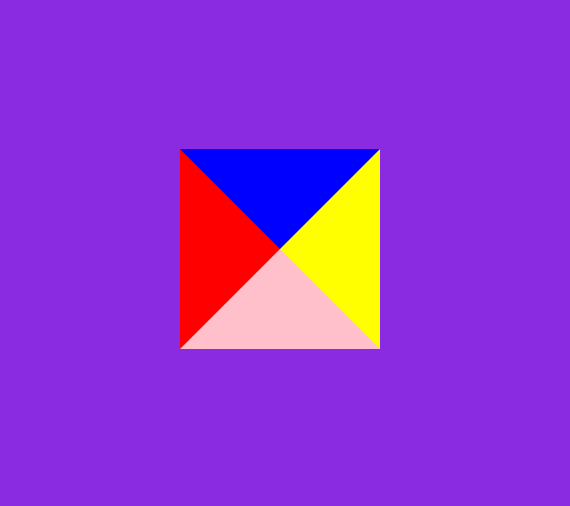
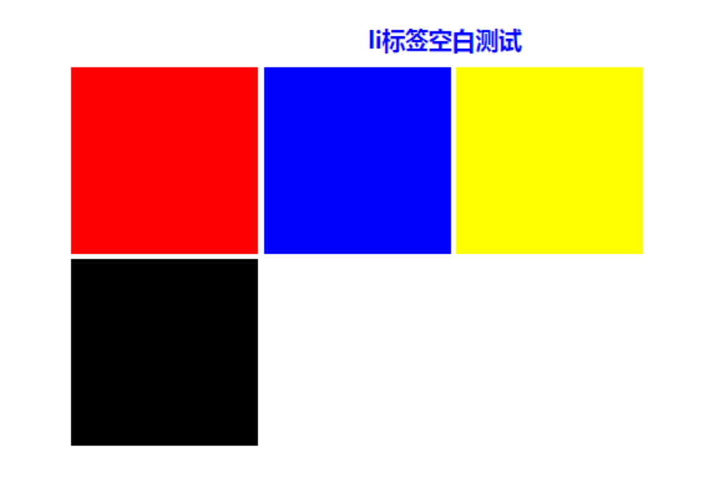
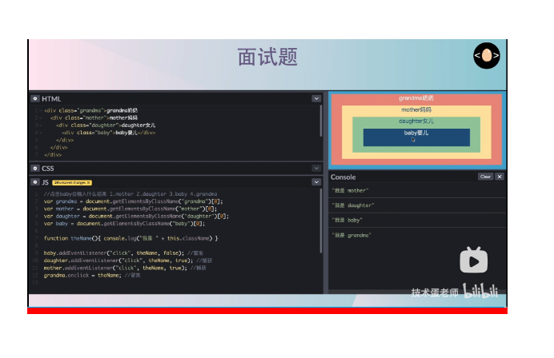
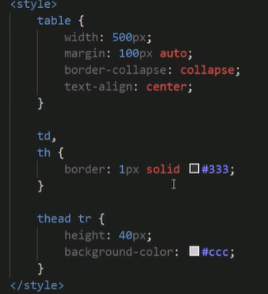

# CSS基础

### box-sizing
当你设置一个元素为 `box-sizing: border-box;` 时，此元素的内边距和边框不再会增加它的宽度。
### 常见的行内元素、块元素、行内块元素
1. **块级元素**（Block-level Elements）：
   - 块级元素独占一行，会自动换行，尽可能地撑满父容器的宽度。
   - 常见的块级元素有 `<div>`, `<p>`, `<h1>` ~ `<h6>`, `<ul>`, `<ol>`, `<li>`, `<table>`, `<form>` 等。

2. **行内元素**（Inline Elements）：
   - 行内元素不会独占一行，可以和其他行内元素在同一行显示。
   - 常见的行内元素有 `<span>`, `<a>`, `<strong>`, `<em>`, `<i>`, `<b>`, `<u>`, `<s>` 等。

3. **行内块元素**（Inline-block Elements）：
   - 行内块元素结合了行内元素和块级元素的特性，可以在一行内显示，并且可以设置宽高、内外边距等属性。
   - 常见的行内块元素有 ``, `<input>`, `<button>` 等。

这些元素的特性对于布局和样式的控制非常重要。通过合理使用这些元素，可以实现丰富多样的网页布局和设计效果。
### 水平垂直居中

##### 块元素
flex 布局（常用）

```css
    .parent {
        display: flex;
        justify-content: center;
        align-items: center;
    }
```

grid 布局（更简洁）
```css
    .parent {
        display: grid;
        place-items: center;
    }
```

translate 偏移居中（绝对定位中最好用的方法，不定宽高）
```css
    .parent {
        position: relative;
    }
    .child {
        top: 50%; left: 50%;
        transform: translate(-50%, -50%);
    }
```
其它的方式实战意义不大，其中 grid 是二维布局特化的属性，只做居中布局其实一维的 flex 就够用了。

绝对定位其他方法：四处都为0它会居中
```css
    .child {
        position: absolute;
        left: 0;
        right: 0;
        top: 0;
        bottom: 0;
        margin: auto;
    }
```
##### 行内元素：
```css
    .parent {
        text-align: center; // 水平居中
        line-height: 600px; // 垂直居中：等于parent的height
    }
```

##### 行内块元素（img/input/td）
方案一
```css
    .parent {
        text-align: center;
        line-height: 600px;
    }
    img {
        vertical-align: middle; // 比行内元素多加一句垂直居中
    }
```
方案二：利用背景图片实现
```css
    .imgBox {
        background: url(...) no-repeat center center;
        background-size: contain; // 等比例，全显示
    }
```

### 隐藏元素的方法

- **display: none**：**结构**消失，触发**回流重绘**
- **visibility: hidden**：结构保留，占据空间，触发**重绘**，**不可选中**
- **opacity: 0**：占据空间，**不回流不重绘**，可以被选中

### 绘制三角形：

原理：用border:
```css
    width: 0;
    height: 0;
    border-top: 50px solid blue;
    border-left: 50px solid red;
    border-right: 50px solid yellow;
    border-bottom: 50px solid pink;
```

实际应用：设置边框透明，想显示哪个，哪个加颜色
```css
    width: 0;
    height: 0;
    border: 50px solid transparent;
    border-top: 50px solid blue;
```

### 行内块元素间的间隔


原因：浏览器的默认行为是把inline元素间的空白字符（空格换行tab）渲染成一个空格，也就是我们上面的代码，li换行后会产生换行字符，而它会变成一个空格，当然空格就占用一个字符的宽度。

解决方案：

- 方法一：既然是因为li换行导致的，那就可以将li代码全部写在一排，如下
```html
    <div class="wrap">
        <h3>li标签空白测试</h3>
        <ul>
            <li class="part1"></li><li class="part2"></li><li class="part3"></li><li class="part4"></li>
        </ul>
    </div>
```


- 方法二：我们为了代码美观以及方便修改，很多时候我们不可能将li全部写在一排，那怎么办？既然是空格占一个字符的宽度，那我们索性就将ul内的字符尺寸直接设为0，将下面样式放入样式表，问题解决。
```javascript
    .wrap ul{font-size:0px;}
```
但随着而来的就是ul中的其他文字就不见了，因为其尺寸被设为0px了，我们只好将他们重新设定字符尺寸。

- 方法三：将li父级标签字符设置为0在Safari浏览器依然出现间隔空白；既然设置字符大小为0不行，那咱就将间隔消除了，随来而来的问题是li内的字符间隔也被设置了，我们需要将li内的字符间隔设为默认。
```javascript
    .wrap ul{letter-spacing: -5px;}
```
之后记得设置li内字符间隔
```javascript
    .wrap ul li{letter-spacing: normal;}
```

### 图片不能撑满盒子
问题：父盒子没有宽高，图片底下有缝隙


示例:
```html
    <div class="box">
        
    </div>
```
解决：
```css
    img {
        width: 300px;
        display:block;
    }
```
### flex布局相关
- 某一子元素单独靠右：`margin-left: auto`

### 一个正常而普通的表格
- 

### 两栏布局
用css实现左右两栏的布局，有哪些方法，列举出常用的所有方法：

实现左右两栏布局的方法有很多种，以下列举了一些常用的方法：

1. 使用浮动（Float）布局：
```html
<div class="container">
  <div class="left-column">左侧内容</div>
  <div class="right-column">右侧内容</div>
</div>
```
```css
.container {
  overflow: hidden; /* 清除浮动影响 */
}

.left-column {
  float: left;
  width: 200px; /* 左侧栏宽度 */
}

.right-column {
  margin-left: 200px; /* 左侧栏宽度 */
}
```
1. 使用inline-block，两栏都设置为这个，但要注意空隙、设置宽度、vertical-aline设置值
2. 使用绝对定位（Absolute Positioning）：
```html
<div class="container">
  <div class="left-column">左侧内容</div>
  <div class="right-column">右侧内容</div>
</div>
```
```css
.container {
  position: relative;
}

.left-column {
  position: absolute;
  left: 0;
  top: 0;
  width: 200px; /* 左侧栏宽度 */
}

.right-column {
  position: absolute;
  left: 200px; /* 左侧栏宽度 */
  top: 0;
}
```

3. 使用flex布局：
```html
<div class="container">
  <div class="left-column">左侧内容</div>
  <div class="right-column">右侧内容</div>
</div>
```
```css
.container {
  display: flex;
}

.left-column {
  flex: 0 0 200px; /* 左侧栏宽度 */
}

.right-column {
  flex: 1; /* 自适应剩余宽度 */
}
```

4. 使用grid布局：
```html
<div class="container">
  <div class="left-column">左侧内容</div>
  <div class="right-column">右侧内容</div>
</div>
```
```css
.container {
  display: grid;
  grid-template-columns: 200px 1fr; /* 左侧栏宽度 右侧栏自适应 */
}
```

这些方法中，使用浮动和绝对定位的方法比较古老，flex布局和grid布局是现代常用的布局方式。选择布局方法时，可以根据具体的需求和兼容性要求来决定使用哪种方法。

针对上述方法的一些问题解答：

1. 浮动布局中，为什么是让left-column浮动，而不是right-column
   在浮动布局中，实际上两栏都可以浮动。左栏（left-column）浮动时，右栏（right-column）会自动填充到剩余的宽度。而右栏浮动时，左栏也会自动填充到剩余的宽度。
   在传统的浮动布局中，左栏浮动的方式更常见，因为浮动元素会脱离正常的文档流，而左栏在前面浮动可以更好地符合文档结构，且在某些特殊情况下可以更方便地实现一些效果。

    不过，需要注意的是，浮动布局会带来一些问题，例如可能需要清除浮动以防止影响后续元素布局。
2. flex布局中，这一句是什么意思flex: 0 0 200px;
   在Flex布局中，`flex: 0 0 200px;` 是一个缩写属性，用于设置Flex项的弹性属性。它由三个值组成：

   1. 第一个值 `flex-grow`：表示项目的放大比例，默认为0。如果所有的项目都设置为1，它们将等分剩余空间。如果某个项目的`flex-grow`为2，而其他项目为1，则前者将占据的剩余空间是后者的两倍。

   2. 第二个值 `flex-shrink`：表示项目的收缩比例，默认为1。如果空间不足，该项目将缩小。如果所有项目的`flex-shrink`都为1，则它们将等比例缩小，直到适应容器。

   3. 第三个值 `flex-basis`：表示项目在主轴上的初始大小，默认为`auto`。这里的 `200px` 表示项目的初始宽度为200像素。

   综上所述，`flex: 0 0 200px;` 的含义是：该Flex项在容器的主轴上，不会放大也不会缩小，其初始宽度为200像素。这样设置可以固定该Flex项的宽度，不受剩余空间的影响。
3. grid布局中的1fr是什么意思
   在Grid布局中，`1fr` 表示一个"fractional unit"（分数单位），它用于定义一个可伸缩的空间。Grid布局将容器划分为网格，网格的列和行可以使用不同的单位来指定其大小。其中，`fr` 单位用于指定一个分数单位。

    `1fr` 表示一个可伸缩的分数单位，它将剩余的空间平均分配给使用了 `fr` 单位的列或行。例如，如果在某一行上有三列，其中两列的宽度使用了 `1fr`，则它们将平均分配剩余的空间，每个列获得相等的宽度。

    示例：

    ```css
    .container {
    display: grid;
    grid-template-columns: 1fr 1fr 1fr; /* 三列，每列宽度相等 */
    }

    .container {
    display: grid;
    grid-template-columns: 1fr 2fr 1fr; /* 三列，中间的列宽度是其他两列的两倍 */
    }
    ```

    使用 `fr` 单位可以让Grid布局更灵活和适应不同屏幕尺寸的布局。

### Position布局
https://zh.learnlayout.com/position.html
- `static`: 默认值，没有被`positioned`
- `relactive`: 可相对另一个`relactive`定位，但不脱离标准流
- `absolute`: 相对`positioned`定位，脱离
- `fixed`：相对饰**视窗**定位
  > 默认情况下，一个 div 元素的宽度是 100%（即默认情况下 width 属性是 auto，表示自动填充其父元素的宽度）。但是，当你将其设置为 position: fixed; 后，它的宽度将会根据其内容和设置的宽度来确定，并且不再受父元素的影响。可以让它左右都为0

例子：codeTest/css-layout/position.html
### 浮动布局
也会脱离标准流，和position一样，其他被遮盖的元素要留出来margin值
### 清除浮动
为什么清除浮动：消除文字环绕的影响
https://zh.learnlayout.com/clear.html
方法：
- 清除对后面元素的影响：后面不想的盒子：`clear:both`
- 浮动的图片比父容器的高度高，溢出到了外面。设置父元素`overflow: auto`
  https://zh.learnlayout.com/clearfix.html

### 响应式布局
**meta的viewport设置**
`<meta name="viewport" content="width=divice-width, initial-scale=1.0"/>`解释：
  - 这句代码是用于设置网页在移动设备上的视口（viewport）的元信息。具体含义如下：

  - `<meta>`：HTML中的元信息标签，用于提供文档的元数据。
  - `name="viewport"`：指定元信息的名称为"viewport"，表示这是用于视口设置的元信息。
  - `content="width=device-width, initial-scale=1.0"`：设置视口的内容，包含两个属性：
    - `width=device-width`：表示视口的宽度与设备的宽度相等，即网页的宽度会根据设备的宽度来自动调整，适应不同设备的屏幕尺寸。
    - `initial-scale=1.0`：表示初始缩放比例为1.0，即网页的初始显示比例为正常大小，不进行缩放。

  通过这个 `<meta>` 标签的设置，可以确保网页在移动设备上有良好的显示效果，使得网页内容在不同设备上都能自动适应屏幕大小，并且保持初始显示比例，避免出现显示不完整或过大过小的问题。这对于移动设备的用户体验非常重要。
**媒体查询**
```css
/* 窗口宽度大于600时 */
@media (min-width:600px) {
  nav {
    float: left;
    width: 25%;
  }
  section {
    margin-left: 25%;
  }
}
/* 窗口宽度小于600时 */
@media (max-width:599px) {
  nav li {
    display: inline;
  }
}
```
### 实现一堆box一行行排列可自动换行的布局：
- 所有盒子`float: left`，后面的元素清除浮动
- 使用`display:inline-block`
  你可以使用 inline-block 来布局。有一些事情需要你牢记：
    - `vertical-align` 属性会影响到 `inline-block` 元素，你可能会把它的值设置为 top 。
    - 你需要设置每一列的宽度
    - 如果HTML源代码中元素之间有空格，那么列与列之间会产生空隙
### flex布局