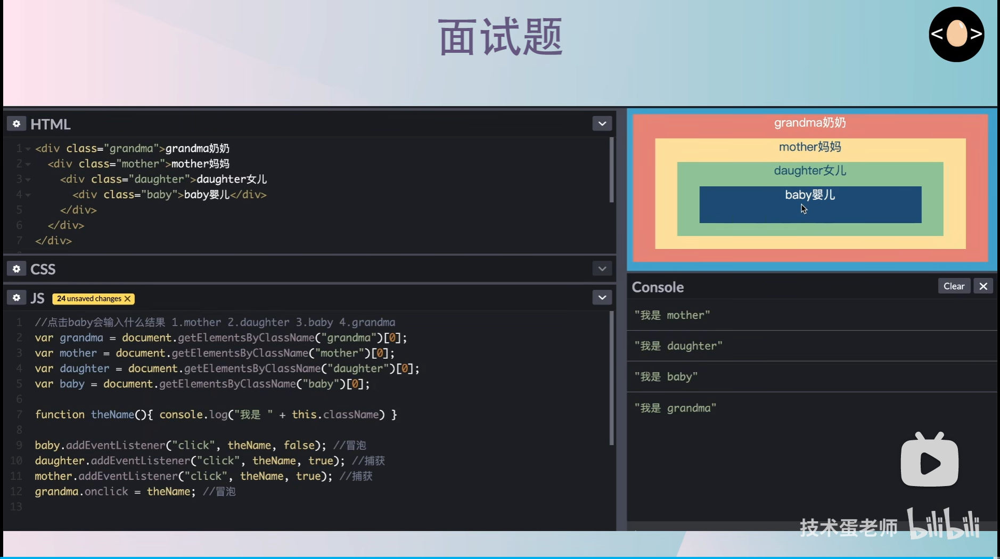

# 面试宝典2.0
---
##　基础部分

### css盒模型

标准盒模型：` box-sizing: content-box`
IE盒模型：`box-sizing: border-box`

### BFC block formatting context

块级元素格式化上下文——被隔离的区间。可以被视为一种布局手段。

**BFC 的子元素不会对外面的元素产生影响**

当出现以下几种情况时，都是因为某个元素对其他元素产生了影响，可以通过使其**父元素**变成BFC元素来解决。
1. margin重合（上下兄弟盒子：包裹父元素，设置overflow:hidden）
2. margin塌陷 （子盒子的margin-top把父盒子拽了下来:父元素设置成BFC）
3. 高度塌陷（父元素没有设置高度，子元素脱离标准流后，父元素没有高度了：父元素设置成BFC）

总而言之，某些元素对其他元素产生影响时，可以通过让其父元素变成BFC元素，来消除影响

常见触发条件：
1. overflow: 不是visible就可以
2. display: 不是block/inline/none就可以
3. position: 不是relative/static就可以
4. float: 不是none

### 回流和重绘

回流：侧重于结构。大小、位置。
重绘：侧重于样式。

**发生回流的情况**
1. 首次页面渲染
2. 添加、删除元素
3. 改变元素大小、位置、内容
4. 改变字体大小
5. 激活 css 伪类
6. 调整浏览器窗口的大小
7. 查询某些属性或调用某些方法(clientWidth浏览器会必须回流来保证数据的准确性)

> 注意：`outline-width`、`box-shadow`、`border-radius` `Visibility `这些属性并不会引起元素大小的改变，而是样式形状的改变，所以属于重绘。

**回流必将引起重绘，重绘不一定引起回流。所以回流的性能开销更大**


**如何减少回流重绘：**
1. 避免频繁操作样式
   1. 一次性改变style属性
   2. 增减class属性
2. 避免频繁操作DOM
   1. **脱离文档流**-修改-放回
   2. **文档碎片**-DOM操作-添加回文档
   3. **隐藏**-修改-放回
3. 避免多次访问以下属性或方法：
   1. clientTop
   2. offsetTop
   3. scrollTop
   4. getComputedStyle()
   5. getBoundingClientRect()
4. 复杂动画
   1. 使用绝对定位脱离文档流
5. 触发css3硬件加速
   1. transform
   2. opacity
   3. filters

### DOM事件流及事件委托机制

- 捕获和冒泡 我懂
  - 顺序：捕获阶段、目标阶段、冒泡阶段
  - onclick绑定，默认冒泡阶段
  - addEventListener：false表示冒泡阶段，true表示捕获阶段
  - 

- 事件委托机制：比如要给每个li绑定点击事件，可以绑定到它们的ul身上，通过冒泡，传到ul上，e.target来判断是哪个子组件

### BOM 和 DOM 的区别

DOM由 w3c 制定，是所有浏览器都应该遵守的标准。而 BOM 则是由各个浏览器自己扩展的对象模型，实现标准并不相同。
BOM 可以看做指代的是浏览器的 window 对象，DOM 则指的是 window.document 对象，可以看出 DOM 的核心是 BOM 的 window 对象中的子对象 document（即 BOM 包含了 DOM）。

> 常见的 window 对象属性：document、location、screen、history、frames
>

### Ajax

Ajax 的全称是 Asynchronous JavaScript and XML，即异步 JavaScript 和 XML。

Ajax 最初是以 XML 作为数据格式的，但现在也常用于处理其他格式的数据，如 JSON。

Ajax 可以看做是一**种标准**或者**思想**，它通过与服务器进行少量数据交换，在**不重新加载整个网页**的情况下来对网页**部分内容**进行**异步动态更新**。

原生js通过 `XMLHttpRequest ` 对象来发送请求

除了使用 XMLHttpRequest 实现异步资源获取，`Fetch` 也是一个更理想、更简单、合理的替代方案。

```javascript
fetch('http://example.com/movies.json')
  .then(response => response.json())
  .then(data => console.log(data))
  ```


