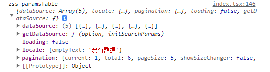

注释中的问题
图片显示不出来正常吗？
数据请求一般在哪里？

图片宽度写死还是响应式

函数可以放在useCallback里
普通变量定义成响应式

提交未提交下拉框内容反了
提交、未提交切换

paramstable: 表格数据，包括分页信息

Effect callbacks are synchronous to prevent race conditions. Put the async function inside:

useEffect(() => {
  async function fetchData() {
    // You can await here
    const response = await MyAPI.getData(someId);
    // ...
  }
  fetchData();

  &.

定位的图片组件用哪种，什么时候用base64那个
图片直接放在images文件夹用相对路径访问吗
闪一下

导航图标路径：\src\components\MenuNav\index.less

1. 申请合作的弹框只有最后一项是不一样的，而且是写死的，是在原组件上修改后直接调用组件，还是不修改原组件，直接把相同的代码复制下来
2. 客户端和管理端显示的页面相同，我需要把可以复用的组件抽出来放到另外的文件夹里吗，应该放到哪个目录下
3. 厂房管理的图标切图到哪里找？下载切图时候的要求
---
1. 样式对照蓝湖上的数值完全精确还是看上去差不多就行
2. 申请合作点击“提交”后是什么逻辑
---

问题：
2. 申请合作的显示是否有条件？
3. joinedEnterprises: [{
        name: string,
      }],客户：是个数组
4. icon通过背景图片的方式吗

已完成：
2. initsearchOptions √
3. 默认变量命名问题 √
4. 管理端的厂房卡片不一样 √
6. 每页厂房数量 √
8. 卡片样式：宽高√、客户显示换行 √
9. 字体大小问题 √
10. loading √

待完成：
3. icon加在按钮上（factorytoolbar参考）
5. nvs在vscode终端使用 √

找资料：
1. css覆盖层级
2. Object.is
3. webpack
4. 移动文件夹：Error: EPERM: operation not permitted, rename 'd:\zss\code-others\iccip-management-ui\iccip-management-ui\src\pages\Customer-UI\cooperate\Factory\cardList' -> 'd:\zss\code-others\iccip-management-ui\iccip-management-ui\src\pages\Customer-UI\cooperate\Factory\imgCardList'
5. 命名
6. 结构设计
7. jsx快捷键入

2023/7/31-2023/8/4 周任务
上周工作：
客户端-我要合作-厂房管理完成
管理端-厂房管理初步搭建

本周工作：
管理端-厂房管理功能完善
客户端-操作台-链接样式修改 web 1920-10
协助协同云开发

**厂房详情**

提示：
启动老项目：npm run qa
待完成：
1. hover显示按钮 √
  审核中：查看
  已发布：查看、退回
  未提交、已驳回：查看、编辑、发布、删除
1. 跳转到详情页 √
2. 设备列表 √
3. 详情组件替换 √
4. 动态生成组件内容 √
5. 设备和素材合并 √
6. 看一下他们的宽高
7. 管理端跳转完成 √
8. 缩小时，蒙版的大小显示处理 √
9.  问后端/产品：发布日期对应哪个数据 √
    1.  搜索：提交日期：create、审核日期：modified
10. 绝对定位设备列表 √
11. 已驳回的小图标找UI
12. 厂房列表对应数据修改 √
13. 申请合作处理
14. 厂房审核的已通过图标替换imgCard/common
15. 审核面包屑处理 √

详情页：待完成
1. 列表添加设置备选项功能
2. 

问题：
需求文档、交互文档(墨刀)、UI文档(蓝湖)不一致以谁为主

c0a86528-89be-13b0-8189-be6443ed0000洁净室
c0a86528-89be-13b0-8189-be6444030001实验室

问题：
1. 用try和catch包裹异步代码
2. 如果一定要在useEffect里读取和设置状态，怎么避免循环