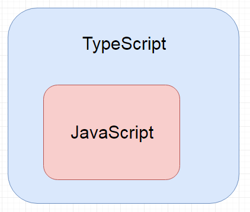
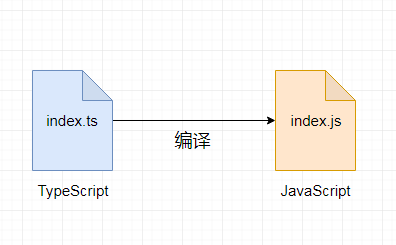

# Typescript
TypeScript是用于应用程序规模开发的JavaScript。

TypeScript是强类型，面向对象的编译语言。TypeScript是JavaScript的一个超集。换句话说，TypeScript是JavaScript加上一些额外的功能。

TypeScript 扩展了 JavaScript 的语法，所以任何现有的 JavaScript 程序可以不加改变的在 TypeScript 下工作。TypeScript 是为大型应用之开发而设计，而编译时它产生 JavaScript 以确保兼容性。
TypeScript 可以编译出纯净、 简洁的 JavaScript 代码，并且可以运行在任何浏览器上、Node.js 环境中和任何支持 ECMAScript 3（或更高版本）的 JavaScript 引擎中。



以下是您提供的HTML文档的Markdown格式转换：

### 解构数组

最简单的解构莫过于数组的解构赋值了：

```typescript
let input = [1, 2];
let [first, second] = input;
console.log(first); // outputs 1
console.log(second); // outputs 2
```


这创建了2个命名变量 `first` 和 `second`。相当于使用了索引，但更为方便：

```ini
first = input[0];
second = input[1];
```

解构作用于已声明的变量会更好：

```typescript
// 对换变量的值
[first, second] = [second, first];
```

作用于函数参数：

```typescript
function f([first, second]: [number, number]) {
    console.log(first);
    console.log(second);
}
f(input);
```

你可以在数组里使用 `...` 语法创建剩余变量：

```typescript
let [first, ...rest] = [1, 2, 3, 4];
console.log(first); // outputs 1
console.log(rest); // outputs [2, 3, 4]
```

当然，由于是 JavaScript，你可以忽略你不关心的尾随元素：

```typescript
let [first] = [1, 2, 3, 4];
console.log(first); // outputs 1
```

或其他元素：

```typescript
let [, second, , fourth] = [1, 2, 3, 4];
```

请注意，此处的Markdown格式可能无法准确地保留代码的高亮显示效果，但已尽力保留其结构和格式。

### 泛型注意点
- 通过使用泛型，我们可以编写可以处理各种类型数据的通用代码，而无需针对特定类型进行硬编码。这使得我们的代码更加抽象、可复用和类型安全。
- 泛型类指的是实例部分的类型，所以类的静态属性不能使用这个泛型类型。