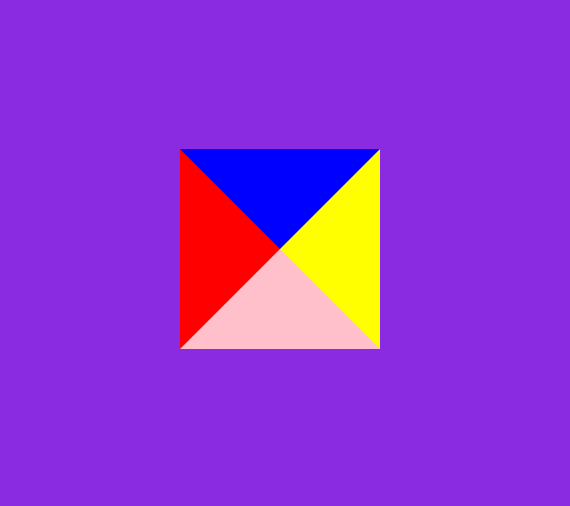
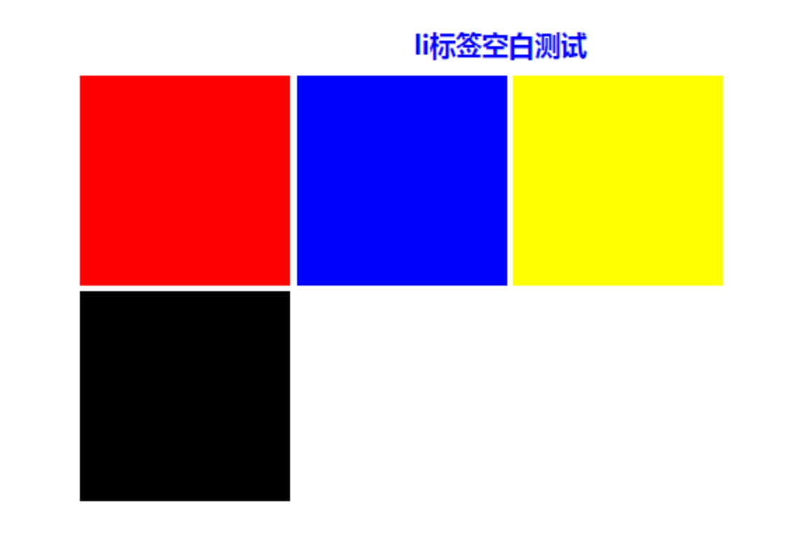
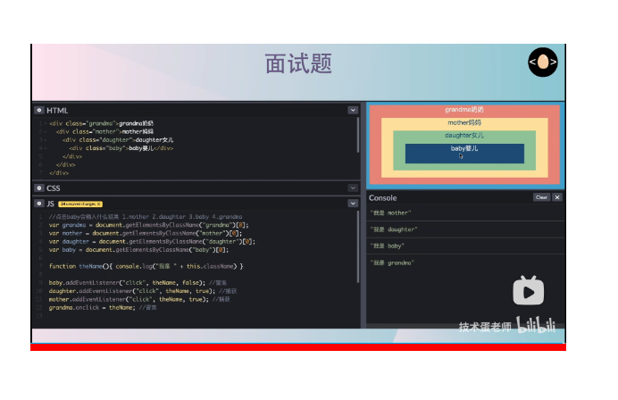
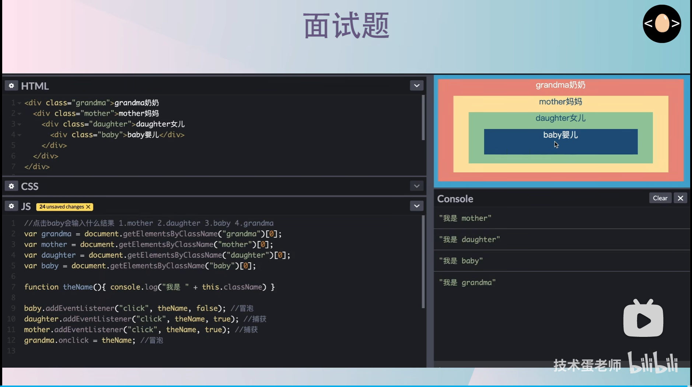

# CSS基础

### 水平垂直居中

##### 块元素
flex 布局（常用）

```css
    .parent {
        display: flex;
        justify-content: center;
        align-items: center;
    }
```

grid 布局（更简洁）
```css
    .parent {
        display: grid;
        place-items: center;
    }
```

translate 偏移居中（绝对定位中最好用的方法，不定宽高）
```css
    .parent {
        position: relative;
    }
    .child {
        top: 50%; left: 50%;
        transform: translate(-50%, -50%);
    }
```
其它的方式实战意义不大，其中 grid 是二维布局特化的属性，只做居中布局其实一维的 flex 就够用了。

绝对定位其他方法：四处都为0它会居中
```css
    .child {
        position: absolute;
        left: 0;
        right: 0;
        top: 0;
        bottom: 0;
        margin: auto;
    }
```
##### 行内元素：
```css
    .parent {
        text-align: center; // 水平居中
        line-height: 600px; // 垂直居中：等于parent的height
    }
```

##### 行内块元素（img/input/td）
方案一
```css
    .parent {
        text-align: center;
        line-height: 600px;
    }
    img {
        vertical-align: middle; // 比行内元素多加一句垂直居中
    }
```
方案二：利用背景图片实现
```css
    .imgBox {
        background: url(...) no-repeat center center;
        background-size: contain; // 等比例，全显示
    }
```

### 隐藏元素的方法

- **display: none**：**结构**消失，触发**回流重绘**
- **visibility: hidden**：结构保留，占据空间，触发**重绘**，**不可选中**
- **opacity: 0**：占据空间，**不回流不重绘**，可以被选中

### 绘制三角形：

原理：用border:
```css
    width: 0;
    height: 0;
    border-top: 50px solid blue;
    border-left: 50px solid red;
    border-right: 50px solid yellow;
    border-bottom: 50px solid pink;
```

实际应用：设置边框透明，想显示哪个，哪个加颜色
```css
    width: 0;
    height: 0;
    border: 50px solid transparent;
    border-top: 50px solid blue;
```

### 行内块元素间的间隔


原因：浏览器的默认行为是把inline元素间的空白字符（空格换行tab）渲染成一个空格，也就是我们上面的代码，li换行后会产生换行字符，而它会变成一个空格，当然空格就占用一个字符的宽度。

解决方案：

- 方法一：既然是因为li换行导致的，那就可以将li代码全部写在一排，如下
```html
    <div class="wrap">
        <h3>li标签空白测试</h3>
        <ul>
            <li class="part1"></li><li class="part2"></li><li class="part3"></li><li class="part4"></li>
        </ul>
    </div>
```


- 方法二：我们为了代码美观以及方便修改，很多时候我们不可能将li全部写在一排，那怎么办？既然是空格占一个字符的宽度，那我们索性就将ul内的字符尺寸直接设为0，将下面样式放入样式表，问题解决。
```javascript
    .wrap ul{font-size:0px;}
```
但随着而来的就是ul中的其他文字就不见了，因为其尺寸被设为0px了，我们只好将他们重新设定字符尺寸。

- 方法三：将li父级标签字符设置为0在Safari浏览器依然出现间隔空白；既然设置字符大小为0不行，那咱就将间隔消除了，随来而来的问题是li内的字符间隔也被设置了，我们需要将li内的字符间隔设为默认。
```javascript
    .wrap ul{letter-spacing: -5px;}
```
之后记得设置li内字符间隔
```javascript
    .wrap ul li{letter-spacing: normal;}
```

### 图片不能撑满盒子
问题：父盒子没有宽高，图片底下有缝隙


示例:
```html
    <div class="box">
        
    </div>
```
解决：
```css
    img {
        width: 300px;
        display:block;
    }
```
