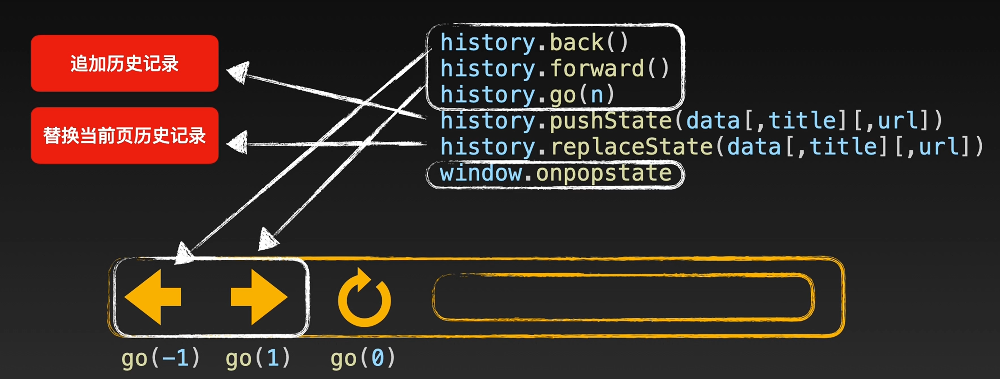

# 浏览器相关
---
### 输入 URL 回车后经过哪些过程
1. 解析 URL，判断是否命中缓存（DNS prefetch），主机在启动时下载DNS高速缓存表，DNS中也有缓存
2. 访问 DNS 服务器，将域名解析，获取 IP 地址
3. 三次握手建立 TCP 连接
4. 发送 HTTP 请求
5. 服务器处理请求并返回 HTTP 报文
6. 浏览器解析渲染页面
7. 断开连接：TCP 四次挥手

### 跨域问题

它是浏览器的一种保护机制，要求域名相等：**协议、域名、端口号**必须都相等

####　解决方法
1. JSONP（JSON with Padding）利用标签script、img
   1. 不支持Post
   2. 存在被恶意注入脚本的风险
   3. 接口异常无法监听

2. CORS（Cross-Origin Resource Sharing）跨域资源共享：在**服务端**设置**响应头**Access-Control-Allow-Origin设置为*。

3. 代理服务器：在**同源**的服务器上设置一个代理服务器，用于转发跨域请求。
   1. 本地工程化项目可以配置 Proxy 代理来跨域请求后端（Webpack、Vite）
   2. 只在调试阶段有用

4. WebSocket,PostMessage(HTML5新特性)：WebSocket 是一种全双工的通信协议，可以在不受同源策略限制的情况下与服务器进行实时通信。

5. 使用反向代理：通过配置反向代理服务器，将前端请求转发到目标服务器，实现跨域访问。常见的反向代理工具有 Nginx、Apache 等。

### 移动端屏幕适配（待续）
1. 利用 meta 标签，viewport 缩放（页面拉伸模糊）
2. 响应式布局（css 媒体查询）
   1. 响应式布局的基本准则：
      -  可**伸缩**的内容区块：内容区块的在一定程度上能够自动调整，以确保填满整个页面
      - 可**自由排布**的内容区块：当页面尺寸变动较大时，能够减少/增加排布的列数
      - 适应页面尺寸的**边距**：到页面尺寸发生更大变化时，区块的边距也应该变化
      - 能够适应**比例**变化的图片：对于常见的宽度调整，图片在隐去两侧部分时，依旧保持美观可用
      - 能够自动**隐藏/部分显示**的内容：如在电脑上显示的的大段描述文本，在手机上就只能少量显示或全部隐藏
      - 能**自动折叠的导航和菜单**：展开还是收起，应该根据页面尺寸来判断
      - **放弃使用像素**作为尺寸单位
3. rem，%，vh vw 等弹性单位（可通过 postcss 插件自动转化 px 单位）

### 数据存储

  1. **cookie**: Cookie 是一种在客户端存储数据的机制。它可以在浏览器和服务器之间传递数据，Cookie 数据存储在用户设备的浏览器中，以文件的形式存储在磁盘上。
     1. 会随着每个请求自动发送，可能会影响网络性能
     2. Cookie 有大小限制（通常为 4KB）
   ```javascript
    document.cookie = "name=John Doe; expires=Fri, 31 Dec 2023 23:59:59 GMT; path=/";
   ```
  2. **Web Storage**: Web Storage 包括两种机制：它们都是在客户端存储数据的 API，通过键值对的形式存储数据。
     1. sessionStorage
        1. 数据在用户**关闭浏览器标签或窗口**时会被**清除**
        ```javascript
            sessionStorage.setItem("name", "John Doe");
        ```
     2. localStorage
        1. 数据在用户**主动清除**或**过期**之前都会一直存在。
        ```javascript
            localStorage.setItem("name", "John Doe");   
        ```
  3. **IndexedDB**: IndexedDB 是一种客户端数据库，可以存储**大量的结构化数据**。它提供了一个异步的 API，可以进行数据的增删改查操作，并支持事务和索引等高级功能。通常存储在磁盘上。IndexedDB 是基于事件驱动的，可以处理大规模的数据集，适用于**离线应用、缓存**等场景。
   ```javascript
    // 打开或创建数据库
    var request = indexedDB.open("myDatabase", 1);

    // 数据库打开成功后的回调函数
    request.onsuccess = function(event) {
    var db = event.target.result;

    // 创建一个事务
    var transaction = db.transaction(["myObjectStore"], "readwrite");

    // 获取对象存储空间
    var objectStore = transaction.objectStore("myObjectStore");

    // 存储数据
    var request = objectStore.put({ id: 1, name: "John Doe" });

    request.onsuccess = function(event) {
        console.log("Data stored successfully");
    };

    request.onerror = function(event) {
        console.log("Error storing data");
    };
    };

   ```
  
  ### 浏览器缓存

  缓存策略都是通过设置 HTTP Header 来实现的，分为强缓存与协商缓存。

  浏览器在请求资源时，**先检查强缓存**，如果缓存有效则直接使用；
  如果强缓存失效，则发送带有**缓存验证信息**的**请求**进行**协商**缓存，服务器根据验证信息判断是否返回新的资源或返回304状态码。

  #### 强缓存

  强缓存是指浏览器**直接从本地缓存中获取资源**，而不向服务器发送请求。
  当浏览器首次请求一个资源时，服务器会返回响应头中的缓存相关字段，如Cache-Control和Expires。这些字段用于告知浏览器该资源的缓存策略。
  如果资源的缓存策略设置为强缓存，并且缓存有效，那么浏览器将直接从本地缓存中加载资源，不再向服务器发送请求，从而提高页面加载速度。
  常见的强缓存字段有：
  - Expires（http 1.0 时期产物）：设置的是具体的过期时间。
  - cache-control（http 1.1 时期产物）：设置的是经过多少时间（单位秒）之后过期，与 Expires 同时存在的话优先级更高。


  #### 协商缓存

  协商缓存是指浏览器在**本地缓存失效**时，向服务器发送请求，通过**与服务器**进行**通信**来确定是否需要重新获取资源。
  当浏览器发起请求时，服务器会返回响应头中的缓存相关字段，如ETag和Last-Modified。这些字段用于标识资源的特征值或最后修改时间。
  浏览器在下次请求相同资源时，会将这些值发送给服务器，服务器根据这些值进行判断，决定是否返回资源内容。
  如果资源未发生变化，则服务器返回状态码**304**（Not Modified），浏览器直接从本地缓存中加载资源。如果资源已经发生变化，则服务器返回新的资源内容。
  常见的协商缓存字段有：
  - Last-modified：顾名思义，最后一次更改时间。
  - ETag：优先级更高，资源的唯一标识。优点是精度更高，因为 Last-modified 时间单位是秒，如果文件在 1 秒内被修改多次就很难侦测到。缺点是性能有一定消耗，因为获得资源的hash值需要额外计算。

### 异步加载

defer 和 async 都是用于控制 script元素的执行时机的属性，都是可以用于**异步加载脚本**，即 script 放在 HTML 中不会阻塞页面渲染。

但它们之间存在一些区别：

- **defer**：脚本会在**文档解析完成后**、DOMContentLoaded 事件触发前执行。多个带有 defer 属性的脚本会按照它们在文档中的**顺序**依次执行。
- **async**：脚本的加载和执行是异步的，脚本**下载完成后会立即执行，不会阻塞 HTML 文档的解析**。多个带有 async 属性的脚本的执行**顺序是不确定**的，哪个脚本先下载完成就先执行。

选择使用 defer 还是 async **取决于脚本的加载**和**执行时机**的需求。

如果希望脚本在文档解析完成后执行，并且有多个脚本需要按顺序执行或存在依赖关系，可以使用 defer。

如果希望脚本的加载和执行尽快进行，并且多个脚本之间没有严格的顺序要求，可以使用 async。

```javascript
<script src="script.js" defer></script>
```

###　前端路由

1. **Hash 路由**

   使用 URL 的哈希部分（`#`）进行路由切换。例如：`http://example.com/#/home`。

   示例使用：
   ```javascript
   window.addEventListener('hashchange', function() {
     // 获取当前路由信息并更新页面
     var currentRoute = location.hash.slice(1); // 获取路由信息
     // 根据路由执行相应的操作
     // ...
   });
2. **history 路由**

    使用 HTML5 的 History API 实现前端路由切换。页面必须运行在http-server上，文件系统打开不行。
    鲨鲨history路由练习项目（./codeTest/path-test）

   

   ```javascript
    // 作用：
    // 1. 添加历史记录
    // 2. 不刷新页面的情况下，修改地址栏，使其更新成新的路径
    history.pushState(null, null, '/home');

    // 监听 popstate 事件，在路由变化时触发(前进、后退等)
    window.addEventListener('popstate', function() {
    // 获取当前路由信息并更新页面
    var currentRoute = location.pathname; // 获取路径信息
    // 根据路由执行相应的操作
    // ...
    });
   ```
   > 与 pushState() 方法不同的是，replaceState() 方法不会创建新的历史记录条目，而是直接替换当前的历史记录条目。这意味着在用户通过后退按钮返回时，会直接跳过被替换的历史记录条目，而是返回到替换之前的历史记录状态。
   > 使用 replaceState() 方法可以在不增加新的历史记录的情况下，修改浏览器的 URL 和页面状态。这在某些情况下很有用，比如进行页面重定向、处理表单提交后的状态更新等。
   **前端路由和前端页面跳转的区别**
   
   前端路由和前端页面跳转是两种不同的概念。

   - **前端路由（Front-end Routing）**是指在**单页应用**（SPA）中**通过 JavaScript 动态地改变 URL**，从而实现页面之间的切换和导航。在前端路由中，页面的内容是动态地根据路由配置和用户操作加载和渲染的，不需要进行完整的页面刷新。

   - **前端页面跳转（Page Navigation**）是指在传统的多页应用中，通过点击链接或提交表单等操作导致整个页面进行刷新和跳转。在前端页面跳转中，每次跳转都会**重新加载**整个页面，包括 HTML、CSS、JavaScript 等资源。这种方式适用于相互独立的静态页面，**每个页面都有独立的 URL**。

### 垃圾回收机制

#### 引用计数算法
如果一个对象被引用次数为 0，对象将被垃圾回收机制回收。
存在循环引用问题，已过时。
```javascript
function f(){
  var o = {};
  var o2 = {};
  o.a = o2; // o 引用 o2
  o2.a = o; // o2 引用 o
}
```
#### 标记清除算法

**标记阶段**：垃圾回收器会从**根对象**（如全局对象、当前执行上下文、活动的函数调用栈等）开始遍历内存中的对象，并**标记所有能够访问到**的对象。

**清除阶段**：在标记阶段之后，垃圾回收器会对**未被标记**的对象进行清除，释放其占用的内存空间。

垃圾回收器通常会使用一些优化技术来提高垃圾回收的效率和性能，例如：

- 分代回收：将内存对象分为不同的代，根据对象的存活时间将其分配到不同的代中，对不同代的对象采用不同的回收策略，以减少回收的开销。

- 增量回收：将垃圾回收的过程分为多个阶段，与应用程序的执行交替进行，避免长时间的停顿，提高用户体验。

- 空闲时间回收：在应用程序空闲的时间段，进行垃圾回收操作，减少对应用程序的影响。

需要注意的是，垃圾回收机制是浏览器内部的一种机制，由浏览器自动管理内存，开发者通常无需直接干预。

但为了优化性能和避免内存泄漏，开发者可以遵循一些最佳实践，如及时释放不再使用的对象引用、避免循环引用等，以帮助垃圾回收器更有效地回收内存。


