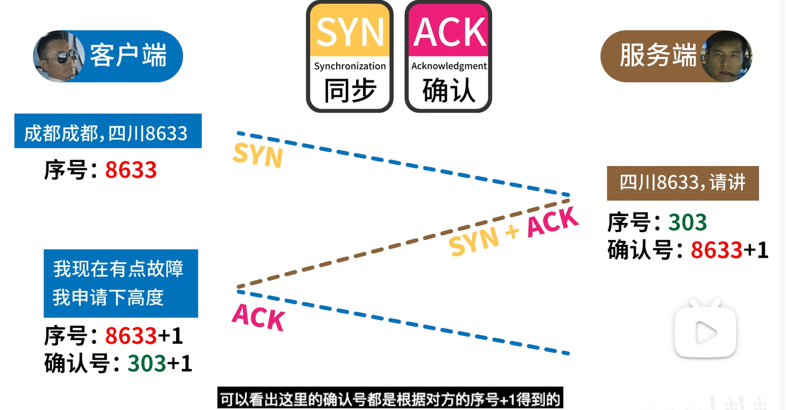

# 网络基础

### HTTP 1.0/1.1/2.0/3.0 的特性
##### HTTP 1.0：

- 确定了协议是**无状态**的，即同一客户端每次请求都没有任何关系
- 消息结构包含请求头和请求体

##### HTTP 1.1：

- 引入了持久连接，即 **TCP 连接默认不关闭**，可以被多个请求复用
- 在同一个 TCP 连接里面，客户端可以**同时发送多个请求**
虽然允许复用 TCP 连接，但是同一个TCP连接里面，所有的数据通信是**按次序**进行的，服务器只有处理完一个请求，才会接着处理下一个请求。
- 新增了一些请求方法（如 PUT、DELETE 等）、新增一些请求头和响应头

##### HTTP 2.0：

- 采用二进制格式而非文本格式
- 完全**多路复用**，而非有序并阻塞的、只需一个连接即可实现**并行**
- 使用报头压缩，降低开销
- 支持服务器推送
  > 服务器推送: 服务器可以在响应中携带额外的资源，并发送给客户端。客户端收到响应后，可以直接使用这些资源，无需再次发起请求。这样可以减少网络延迟，提高页面加载速度和性能。

##### HTTP 3.0

弃用 TCP 协议，采用一种新的更快的网络协议 QUIC（基于 UDP 协议）
暂时未广泛使用

### HTTPS
- 使用了 SSL/TLS 协议进行了加密处理，相对更安全
  > SSL/TLS: 加密协议，SSL是TLS的前身，已经过时。加密分为对称加密，非对称加密。
  > 对称加密：用同一把秘钥进行加密和解密，问题是如果秘钥被截获，将泄露信息
  > 非对称加密：双方各有一对儿秘钥，公钥和私钥，公钥互相交换，用来加密，私钥自己留着，用来解密。即便公钥被截获，也没关系。因为公钥只是用来上锁的，不是用来解锁的。

- 默认端口 443
- 由于需要涉及加密以及多次握手，实际性能会稍逊 HTTP

###　WebSocket

- 是一种建立在单个 TCP 连接上进行**全双工**通信的**协议**。
- 浏览器和服务器两者之间可以创建**持久性**的连接，并进行**双向**数据传输。（HTTP/2 虽然也具备服务器推送功能，但 HTTP/2 只能推送静态资源）
- 没有同源限制，天然支持跨域。
- 可以发送文本格式和二进制格式，性能和效率也更高。

WebSocket通常应用于需要**实时双向通信**的场景。下面是一些常见的应用场景：

- **即时通讯**：WebSocket非常适合用于实现即时通讯应用，如在线聊天、实时消息推送等。它可以实现实时性强、低延迟的双向通信。

- **实时数据更新**：对于需要实时更新数据的应用，如股票行情、实时监控等，WebSocket能够提供高效的数据传输和实时更新。

- **多人协作**：在协同编辑、多人游戏等场景中，WebSocket可以实现多用户之间的实时协作和同步。

- **实时地理位置追踪**：当需要实时追踪用户位置或车辆位置时，WebSocket可以提供实时的位置更新，如出租车定位、物流追踪等。

- **在线客服**：通过WebSocket实现在线客服功能，能够实现客户与客服的实时交流和支持。

总之，WebSocket适用于任何需要**实时双向通信**的场景，其中**实时性和实时更新**是重要的需求。与传统的HTTP请求相比，WebSocket能够提供**更低的延迟**和**更高的效率**，使得实时交互和数据更新变得更加便捷和高效。

###  GET 和 POST 区别

- GET请求的**数据长度**有限制，一般受限于URL的长度限制，而POST请求没有严格的长度限制。
- Get 通过 URL 编码传输数据，Post 通过 body 传输，支持多种编码格式（两者**都是明文**传输，都不是安全的，但 Get 参数直接暴露在 URL 上，不能用来传递敏感信息）
- 浏览器会**缓存 Get** 请求，Post 则不会缓存。（在该特性下Get请求可能会出现 304 不更新，解决方法：链接加个随机参数）
- **使用场景**：GET请求常用于获取资源的操作，例如获取网页、获取数据等；POST请求常用于提交数据、表单提交、发送请求等。
- 幂等性：**GET请求是幂等的**，即多次相同的GET请求对服务器的状态不产生影响。而POST请求不是幂等的，多次相同的POST请求可能会对服务器的状态产生变化。

### 网络安全
以下是一些常见的网络安全攻击类型：

- **跨站脚本攻击（XSS）**：攻击者通过注入恶意脚本代码到网页中，使得用户在浏览网页时执行该恶意脚本，从而获取用户敏感信息或在用户端执行恶意操作。

- **跨站请求伪造（CSRF）**：攻击者通过欺骗用户在受信任的网站上执行恶意操作，从而在用户不知情的情况下冒充用户的身份发送恶意请求，常利用cookie信息，执行攻击者预期的操作。
  > 比如：攻击者通过创建一个诱导性的网站（例如，通过电子邮件或社交媒体分享），诱使受害者访问该网站。这个诱导性网站上包含一个看似无害的图片标签，但实际上，该图片标签引用了银行网站的转账URL。
  > 当受害者访问这个诱导性网站时，他们的浏览器会加载这个图片，并自动发送一个GET请求到银行网站，该请求会携带受害者在银行网站上的有效登录凭证（例如，包含在cookie中的会话ID）。
  > 银行网站在接收到请求后，会验证请求中的登录凭证，如果凭证有效，就会执行转账操作。由于该请求是由受害者的浏览器自动发送的，银行网站无法区分是受害者本人发送的请求还是攻击者伪造的请求。
  > 因此，攻击者成功利用了受害者的身份和权限，在受害者不知情的情况下执行了转账操作。

- **SQL注入攻击**：攻击者通过在应用程序的输入参数中注入恶意的SQL语句，从而绕过应用程序的验证和控制，获取敏感数据或修改数据库内容。

- **代码注入攻击**：攻击者通过在应用程序的输入参数中注入恶意代码，使得应用程序在执行过程中执行攻击者的恶意代码，从而获取敏感数据或执行恶意操作。

- **拒绝服务攻击（DoS）**：攻击者通过向目标系统发送大量请求或占用大量系统资源，使得目标系统无法正常提供服务，导致服务不可用。

- **社会工程攻击**：攻击者通过利用人们的社交工程技巧，欺骗用户泄露敏感信息、访问受限资源或执行恶意操作，例如钓鱼攻击、电话诈骗等。

- **中间人攻击**：攻击者通过篡改网络通信流量，在通信的两端之间进行监听、修改或注入恶意内容，从而获取敏感信息或执行攻击。

### TCP三次握手，四次挥手

#### 三次握手
建立一个 TCP 连接需要先进行三次握手，因为双方要确认各自发送与接收功能是否都为正常，最少需要三步才能验证。

**第一次握手**：客户端向服务端发起请求，服务端接收了报文，此时**服务端**可以确定**客户端发送功能正常**，**自己接收也正常**。
**第二次握手**：服务端响应报文给客户端，客户端接收了报文，此时客户端确认了自己和服务端的发送、接收功能都正常，但此时**服务端还不确定自己的发送是否正常**（也就是服务端还不知道客户端是否能收到它的信息）。
**第三次握手**：客户端回应了服务端的响应报文，说明服务端也可以正常发送，至此双方都确认了各自的收发功能正常。

鲨鲨自己的理解：双方都要经历一次发、收的过程，才能确认自己和对方的发送和接收都没问题。所以至少要三次握手。 

为什么不是两次握手？
如果网络信道有延迟，客户端发送SYN两次，第一次延迟了，第二次收到了SYN+ACK建立了连接。
过段时间后，第一次发的SYN服务端收到了，就再次返回SYN+ACK建立连接，但是客户端并不知道，在客户端，它以为只有一个连接。
#### 四次挥手
鲨鲨自己的理解：双方都要经历一次请求关闭、确认对方的过程。只不过中间要等待被请求的一端数据发送完，所以才会出现四次挥手。 

### 域名发散与域名收敛
  浏览器对于 **TCP 链接有并发数限制**，主要是为了不让 DoS 这类攻击的成本太低。
- **域名发散：将静态资源放在多个子域名下**，以此实现多线程下载，突破**并行**数，在客户端加载大量静态资源时可以更迅速。
- **域名收敛**：相反地，将静态资源集中放在一个域名下，刻意减少 DNS 解析的开销。

**域名发散**适用于需要**并行加载大量内容**的场景，特别是对于大型网站或应用程序来说，可以提高加载速度和性能。然而，域名发散需要更复杂的域名管理和配置。
**域名收敛**适用于小型网站或应用程序，**简化了域名管理和配置的复杂性**，但可能在同时加载大量内容时性能稍差。

